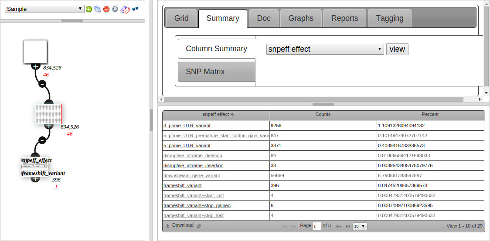

# Analysis - advanced

## Analysis settings

In an analysis click the  to open the analysis settings page. 

* **Genome build** - Cannot be changed. Only data (eg VCF samples) from this build can be used in the analysis.     
* **Analysis type** - One of (Singleton/Cohort/Trio/Pedigree) set at creation if using an auto-analysis. 
* **Custom columns** - Columns to use - from [customise columns](../settings/columns.md). Default set in [user settings](../settings/user_settings.md) 
* **Default sort by column** - Can be used for example to make the grid always sort by gene.
* **Annotation Version** - The [Annotation Version](../annotation/annotation_details.md) used.

## Node Counts

The numbers below a node are counts of variants that meet a certain criteria. The colours correspond to names in bottom left hand legend, eg in the image below, there are 32 ClinVar (Likely) Pathogenic variants in that node. 

Click on a count to load the variants in the node that meet that criteria, eg clicking on the red 32 would just load the ClinVar variants.    

To edit which node counts are shown, open analysis settings, then select the "node counts" tab.

Drag and drop the node counts to show/hide them and change the order.

## Column Summary

The second tab (Summary) is used to view what values are in a column. Qualitative data is counted and shown in a grid, such as snpEFF Effect in the screenshot below:

Clicking on the link in the 1st column creates a child node filtering to that value. This is useful for getting an overview then drilling down into your data.

The screenshot shows 396 entries under "frameshift variant", and the filter node created underneath the current (red bordered) node, which is configured to filter to snpeff_effect = frameshift variant, and also has 396 variants after filtering.

Quantative data (numbers, such as for the af_1kg column (1000 Genomes Alt Frequency)) is shown as a box-plot.

