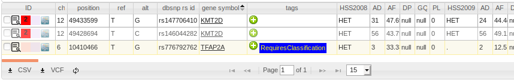

## Analysis Classification

Recommended workflow to create a [classification](../classification/variant_classification.md) from a variant in an analysis:

1. [Tag](../analysis/tagging.md) the variant with the "RequiresClassification" tag.

2. Click the , then then "Classification" tab.

3. Select the sample, then click the **[classify]** button. 
