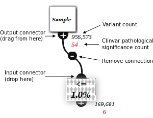
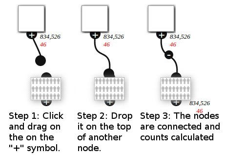
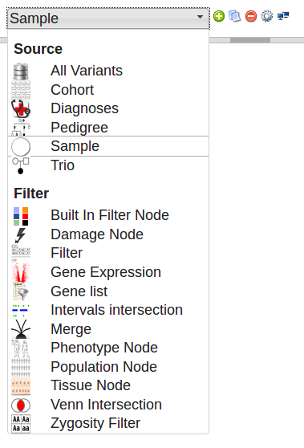
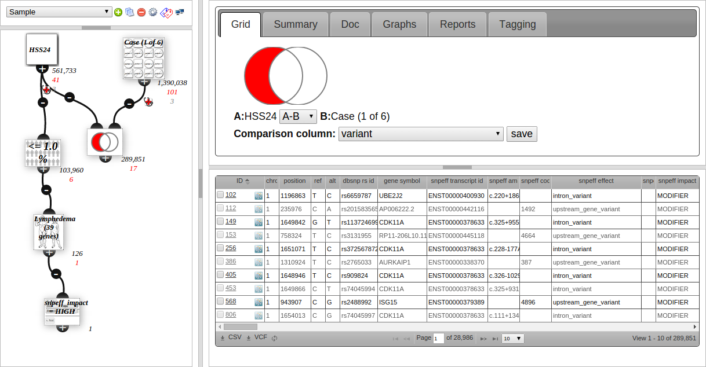

# Analysis Intro

Create custom variant filters by connecting together nodes representing sources or filters of variants. See [analysis nodes](nodes.md)

Other variant databases allow similar creation of filters, but VariantGrid can constuct nodes in real-time, enabling rapid exploration of large and difficult genomic data sets.

## Analysis Nodes

The top node is configured to show a particular patient exome (from an uploaded VCF).

These variants are then filtered to those that are less than 1% of the population.

To add a node, select the node type from the drop down menu in the top left of the screen and click the 

Click and drag a node to move it around. You can select multiple nodes by drag-selecting a box around them. This allows you to copy, delete or move them as a group. Delete selected nodes by pressing DELETE, or click the .

## Analysis screen

The screenshot above shows the VariantGrid analysis screen. The node graph is on the left part of the screen, showing the user built filters.

Click a node to select it. This loads the [node editor](node_editors.md) (top right) and a [grid of the variants](analysis_grid.md) in the node (bottom right).

Clicking on the node loads this editor window. The [node editor](node_editors.md) is different depending on the type of node.

### Column Summary

The second tab (Summary) is used to view what values are in a column. Qualitative data is counted and shown in a grid, such as snpEFF Effect in the screenshot below:

Clicking on the link in the 1st column creates a child node filtering to that value. This is useful for getting an overview then drilling down into your data.

The screenshot shows 396 entries under "frameshift variant", and the filter node created underneath the current (red bordered) node, which is configured to filter to snpeff_effect = frameshift variant, and also has 396 variants after filtering.

Quantative data (numbers, such as for the af_1kg column (1000 Genomes Alt Frequency)) is shown as a box-plot.

