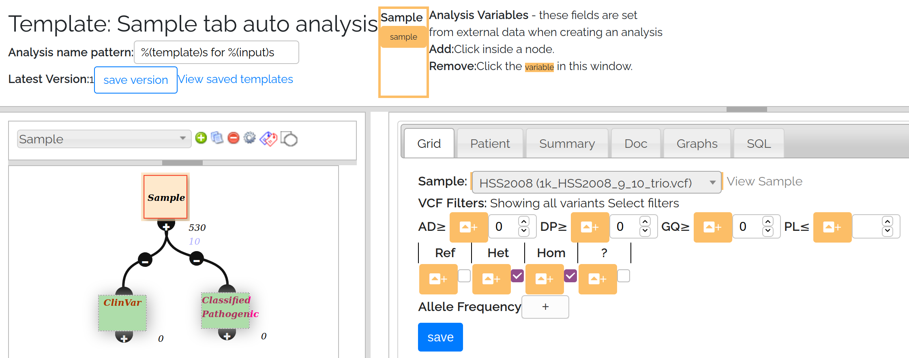
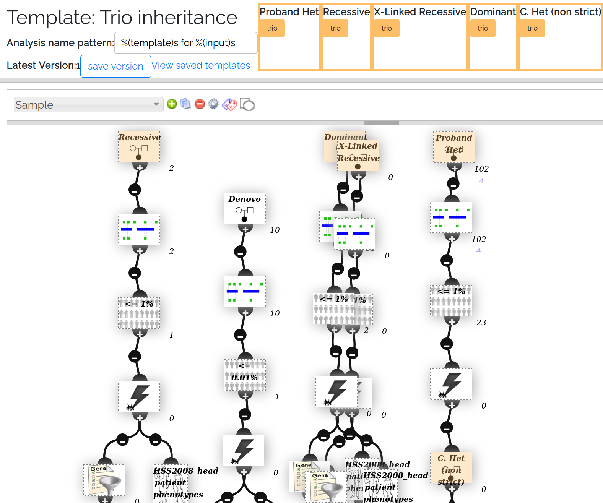

# Analysis - templates

Menu: **[Analysis]** -> **[Templates]**

## Overview

The fastest and easiest way to run an [analysis](analysis_intro.md) is to apply a pre-defined analysis template to your sample, trio or cohort. This allows you to quickly run the same analysis over different data without needing to build or edit analysis settings. 

VariantGrid comes with a number of pre-configured analyses templates - all of which can be modified by the database admin as required. In addition, users can build their own templates using the template wizard. A template is built in the node editor in the template wizard the same way as a normal analysis, however, there is an option to configure the sample, trio and/or cohort fields as 'analysis variables', allowing these fields to be set from new data each time the template is applied.

To see the analysis templates currently available in your installation go to **[Analysis]** -> **[Templates]**. 

## Running Analysis templates

You can create an analysis from an existing template using the 'Create from Template' button in the "Analysis" section at the bottom of the Sample, VCF, Cohort, Trio and Pedigree pages. Each analysis template has an expected input type (sample, trio or cohort). Only templates that match the data type on that page are shown. For example, trio templates will only be displayed on the trio page, but not on a sample page and vice versa. 

When an analysis has been created from a template, a 'Template Run' tab will be displayed in the analysis settings window. This will record a list of the variables that were used to generate the analysis. 

If the template includes downstream nodes that are dependent on sample or patient-related inputs these nodes will be updated accordingly. This will occur in the following circumstances: 
* Zygosity node - the input sample will be used as the zygosity sample
* Gene list node using a sample gene list - the active gene list for that sample will be applied 
* Phenotype node using the patient phenotype - the phenotype terms will be updated to match the phenotype of the patient linked to the sample (if available)

The analysis can be modified as usual.

An analysis template is created for a particular genome build, but will run without error on any build provided build-specific data is not required in the analysis. For example, a GRCh37 analysis template containing a Genomic Intersection node bed file will not run as the GRCh37 file can't be applied to GRCh38 data. Note that care should be taken to validate that any filter settings used are applicable to the non-native build. 

## Creating Analysis Templates
There are two methods available to create analysis templates:  
* Create a new (blank) template from the Analysis templates page **[Analysis]** -> **[Templates]**  In this method you will need to manually set the source node sample field(s) as an analysis variable(s).
* Copy an existing analysis. **[Analysis]** -> **[Analysis settings]** (cog icon) -> **[Create Template]** tab -> **[Create Template from this analysis]** button. This method will automatically set the source node as an analysis variable.

To save a template, click the **[Save version]** button on the top bar. Templates must be saved before they can be used.

The screenshot below shows an analysis template in the analysis wizard window. Nodes colored orange contain analysis variables, which also appear in the top bar. Green nodes are 'output nodes' representing the filtered variants of interest.

*Setting an analysis variable:*
Open a node, then in the node editor click the orange button next to a field to make it an analysis variable. This will make the widget unselectable, and add the field to the top bar. In the example above the sample field has been set as an analysis variable. Currently only the sample fields on the sample, trio and cohort nodes can be set as analysis variables. 

To remove an analysis variable, click on the field in the top bar.

*Setting an output node:*
To define an output node, click on the node and select the **[doc]** tab. Make sure the node has a good, unique name then select the **[output node]** check box and save. This will turn the node green indicating it is set as an output node.

### Handling configuration failure

Sometimes parts of an analysis may not make sense depending on the input data. For instance in Trios, whether the parents are affected determines whether you want to use Dominant or X-linked inheritance model filters.

When an analysis is run, nodes run internal checks to make sure they are configured correctly, so for instance a TrioNode configured to "Dominant" on a trio with unaffected parents will be invalid (node and all descendants will error + flash red) 

So to handle this, build all the filters in the template, then for nodes that you expect to sometimes error out due to configuration, go to the Node Editor **[Doc]** tab -> **[Hide node and descendants upon template configuration error]**

### Tips and tricks

* In the Trio inheritance screenshot above, note the top right node is a TrioNode configured to "Proband HET". If you were building this analysis by hand, you might use a HET SampleNode, however this would then require you to have an anaylsis variable of type "Sample" (which we'd be unable to set via the Trio page)   
* Node editors hide options based on data (eg GeneListNode will not allow you to select "sample gene list" if samples do not have one) so configure the template using data that is as similar as possible to what you intend to use.

### Configuring where templates are shown

You can further configure how/where templates are shown (currently admin only)

* appears_in_autocomplete (default=True)
* appears_in_links (default=False)
* requires_sample_somatic (default=False)
* requires_sample_gene_list (default=False)
