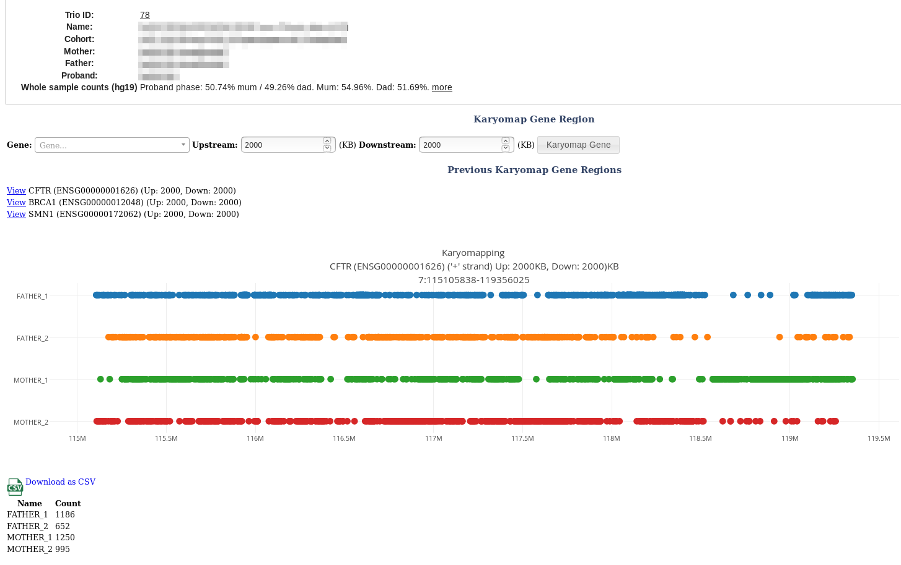

# Karyomapping

## Background

We handle the simpler case of a [Trio](../patients/trios.md) with an affected child (ie proband/mother/father).

"In phase" implies that the allele from a parent is the same as that in the affected child

Variants are assigned to the following bins 

F1ALT: Paternally inherited, in phase with affected child, ALT variant.
F1REF: Paternally inherited, in phase with affected child, REF variant.
F2ALT: Paternally inherited, out of phase with affected child, ALT variant.
F2REF: Paternally inherited, out of phase with affected child, REF variant.

And vice versa for the mother. The only variants that fall into each of these situations are:

|    Child GT    |    Father GT     |    Mother GT     |     Bin |
| ------------- |:-------------:| -----:|-----:|
| ​0/1 |    0/1 | 0/0 | F1ALT |
| 0/1 |  0/0|   0/1| M1ALT | 
| 0/1 | 0/1 |  1/1 |  F1REF | 
|  0/1 |  1/1 |  0/1 | M1REF | 
| 0/0 |  0/1 | 0/0 | F2ALT | 
|  0/0 |  0/0 |     0/1 |  M2ALT | 
| 1/1 |  0/1 | 1/1 |  F2REF  | 
|  1/1 |  1/1 |  0/1 |  M2REF| 

## Gene analysis

Menu: **[analysis]** -> **[karyomapping]**

Enter a gene name and click **[Karyomap Gene]** button.

## Genome-wide analysis

A genome wide karyomap count is performed when you create a trio. This is useful for finding sample mixups.

This is summarised as _Proband phase: 50.74% mum / 49.26% dad. Mum: 54.96%. Dad: 51.69%._ and is visible on the gene analysis screenshot above and the [Trio](../patients/trios.md) page. 

Proband phase shows the child's marker percentage from each parent.
Mum%/Dad% = Percent of parent markers that are in phase in proband.

Here are some examples for various Trios:

| Description  |  PP mum  | PP dad  | Mum % |  Dad % |
| -------------|:--------:|:-------:|:-----:|-----:|
| Real Trio 1  | 53% | 47%  | 52.1%  | 45.9 |
| Real Trio 2  | 52.3% | 47.7%  | 46.1% | 45.9% |
| Bad Trio (Trio 1 with random dad) | 60.2% | 39.8% | 52.1% | 25.7% |  
| Bad Trio (unrelated samples) | 48.5% | 51.6% | 30.8% | 29.8% | 
| Bad Trio (mother/proband swapped) | 60.8% | 39.2% | 86.9% | 36.1% |

As a rough rule, you'd expect a minimum of 40% for an actual child. 

 