# Analysis Nodes

## Source Nodes

Provide a source of variants

### All Variants

All variants in the database.

### Cohort

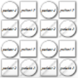

A collection of related samples, eg "control group" or "poor responders"

### Classifications

### Pedigree

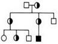

Variants from family samples filtered by genotype according to inheritance models

### Sample

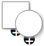

A sample, usually one genotype (patient, cell or organism) with a set of variants.

### Trio

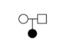

Mother/Father/Proband - filter for recessive/dominant/denovo inheritance

## Filter Nodes

These nodes filter variants connected to the top of them

### Built In Filter

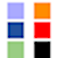

Built in filters used in node counts eg High or Moderate Impact / OMIM / ClinVar Pathological

### Damage

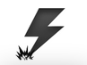

Filter to damage predictions

### Filter

Filter based on column values

### Gene List

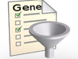

Filter to a list of gene symbols

### Intervals Intersection

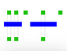

Filter based on intersection with genomic ranges (eg .bed files)

### Merge

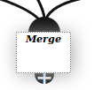

Merge variants from multiple sources

### Phenotype

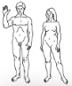

Filter to gene lists based on ontology keywords

### Population

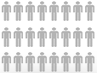

Filter on population frequencies in public databases (gnomAD/Exac/1KG/UK10K) or number of samples in this database.

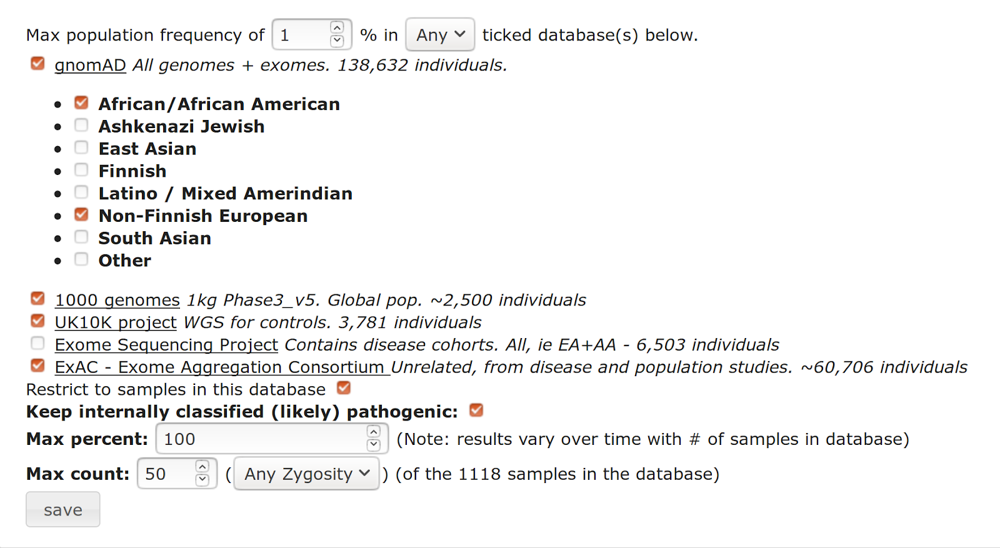

### Tags

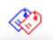

Filter variants to those that have been [tagged](tagging.md)

### Tissue Expression

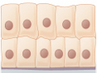

Filter based on tissue specific expression (from Human Protein Atlas)

### Venn

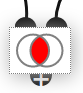

A filter based on set intersections between parent nodes

### Zygosity

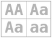

Compound HET and other Zygosity filters

