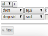

# Analysis Nodes

## Source Nodes

Source nodes allow you to add variants to your analysis either by adding samples, groups of samples, or groups of variants from within the VariantGrid database. Each source node provides options to filter the variants available.  Before changing the default filters available on the source nodes it's important to be familiar in interpreting variant zygosity and parameters (AD,DP,GQ,PL, AF) as these filters will have a marked impact on the variants displayed for analysis.

The following sections provide details of each of the different source nodes and associated filters available to curators.

### All Variants

This node will add all variants available in the VariantGrid database at the time the node is added. Only variants from data and samples for which you have permission will be displayed. These variants can be filtered by gene and zygosity as required. The default filter is to require a minimum of 1 zygosity call as this removes variants with unknown zygosity or variants that are not associated with samples in the database. 

By default only variant calls are displayed (e.g. hom_alt, het). To see reference calls (hom_ref), check the 'Show Reference Variants', but be aware that this will dramatically increase the size of the data set. In general, reference calls are only available from multi-sample vcfs. 

The All Variants node reflects the variants in the database at a point in time. To update the node to reflect the current database state, simply re-click the 'Save' button at the bottom of the All Variants node settings. All child nodes will be automatically recalculated to reflect the change.

### Cohort

Used to add a collection of related samples, eg "control group" or "poor responders". 

VariantGrid will automatically generate a cohort for each vcf upon upload. This cohort will contain all samples in the vcf. All other cohorts need to be defined manually by the user. Once defined, a cohort will be available for selection in the dropdown menu on the cohort node. It is recommended, though not essential, that samples to be analysed as a cohort are joint-called in the same vcf where possible. 

There are two main approaches available to filter variants within a cohort:
1. **Parameter Filtering:** Filtering based on any combination of the variant parameters AD,DP,GQ,PL or AF. Parameter filtering will be applied to all samples in the cohort. Note that not all vcfs will contain values for these parameters. Missing values will result in variants being inadvertently filtered from the cohort, so check your samples carefully before applying these filters. 
2. **Zygosity filtering:** There are 3 methods for filtering cohorts by zygosity: zygosity counts, simple zygosity or sample zygosity. The selected method is the method that is expanded after the node filters have been saved. 

Parameter and zygosity filtering can be applied together, however, only one zygosity filter type (count, simple or sample) can be applied at any one time. 
By default cohorts are filtered using only the simple zygosity method: Het or Hom_Alt for ALL samples. 

### Classifications

The Classifications node is used to add internally classified variants to the analysis workflow. 

Use the 'Less than or equal to', 'Exactly' or 'Greater than or equal to' options to filter classified variants by clinical significance. 

This filter can also be used to remove variants that have been classified as artefacts, drug response or risk factor from an analysis. To do so, select 'exactly' 'other' filters and then use a venn node to subtract this variant list from your other nodes of interest. 

### Pedigree

Variants from family samples filtered by genotype according to inheritance models.

### Sample

This node will load all variants present in a sample (equivalent to a single column in a vcf). A sample is usually one genotype (patient, cell or organism) with a set of variants.

This node is particularly useful for singleton analyses. Similar to the cohort node, a sample node can be filtered by variant parameters AD,DP,GQ,PL or AF (if available in the vcf), and also the variant zygosity. 

### Trio

This node adds all variants present in a trio of samples. Trios need to be defined manually by the user. This includes specifing parental and proband samples, along with the affected status of the samples. Once defined, a trio will be available for selection in the dropdown menu on the trio node in the analysis workspace. It is recommended, though not essential, that samples to be analysed as a trio are joint-called in the same vcf where possible otherwise it is not possible to determine whether missing data is due to a reference call or a lack of coverage at the locus. 

Each trio node requires an inheritance mode to be selected. This selection will then filter the variants according to the zygosities as listed in the table below. Only one inheritance mode can be selected per trio node. To assess multiple different modes of inheritance add multiple trio nodes to the analysis workspace. Use the default trio analysis template to quickly construct a trio analysis. 

Required zygosity calls for each mode of inheritance in the trio node: 

|                    | Proband      | Mother       | Father       |
|--------------------| ------------ | ------------ | ------------:|
| Recessive          | HOM ALT      | HET          | HET          |
| Dominant (both)    | HET, HOM ALT | HET, HOM ALT | HET, HOM ALT |
| Dominant (mother)  | HET, HOM ALT | HET, HOM ALT | REF          |
| Dominant (father)  | HET, HOM ALT | REF          | HET, HOM ALT |
| Denovo             | HET, HOM ALT | REF          | REF          |
| X-Linked Recessive | HOM ALT      | HET          |              |

In addition to the above modes of inheritance the trio node can be used to filter a sample to compound het variants. To do so add the trio node below an existing workflow for a sample and select the compound het mode of inheritance. This filter finds common genes with *both* "het from mother" and "het from father" and zygosity of (het from mother OR het from father) as per the table below.

Note that the placement of the compound het filter within a workflow is important. If the node input contains too many variants or artefacts, many false positive compound het calls will be shown in the trio c.het node. Conversely, if the filtering has been too stringent, real compound het variants will be excluded. 

Compound HET

|                    | Proband      | Mother       | Father       |
|--------------------| ------------ | ------------ | ------------:|
| Het from mother    | HET          | HET          | REF          |
| Het from father    | HET          | REF          | HET          |

If "require parent zygosity" is False - parent zygosities may be "Unknown". Selecting this option will allow variants with low or no coverage in parental samples to pass the zygosity filters. Note that if the samples have not been joint-called this may also allow parental reference calls through due to missing data. 

## Filter Nodes

These nodes filter variants connected to the top of them

### Allele Frequency

Filter based on a sample's allele frequency.

### Built In Filter

Built in filters used in node counts eg High or Moderate Impact / OMIM / ClinVar Pathological

### Effect

The effect node allows for quick filtering of variants based on a combination of predictions and information sets. 

To enable any of the pre-set filters, click the left checkbox then move the slider to select variants meeting or exceeding the set threshold (T). By default, if multiple filters are selected variants will be shown that meet **ANY** of the of the criteria. It is recommended to **ALWAYS** include IMPACT min = HIGH in a basic filter set as this will prevent inadvert loss of intronic/indel/start/stop etc. variants that lack prediction data.

#### AVAILBLE FILTERS

**Impact min**  
Allow variants with an impact greater or equal to the threshold.  
Impact levels are ordered as follows: MODIFIER < LOW < MODERATE < HIGH  
For example, impact min = LOW will display variants with IMPACT = LOW OR MOD OR HIGH

**Splice min**  
Variants meeting the following criteria will be displayed: 
dbscSNV.ADA >= T OR   
dbscSNV.RF >= T OR  
SliceAI.DL.Score >= T OR  
SpliceAI.DG.Score >= T OR  
SpliceAI.AL.Score >= T OR  
SpliceAI.AG.Score >= T OR   
is splice indel 

A splice indel is defined as: (splice region is not null AND variant class is not SNV). Splice indels have been included to ensure that insertions, deletions and complex variants in a splice region are not removed by the filter as these variants are not assessed by splicing predictors. 

**CADD score min**  
CADD phred >= T

**REVEL score min**  
REVEL score >= T

**COSMIC count min**  
COSMIC count >= T

**Damage predictions min**  
sum(pathogenic predictions for variant) >= T

A prediction is considered pathogenic if it meets the following criteria:
* SIFT = damaging
* Polyphen2 = possibly or probably damaging
* Mutation assessor = medium or high
* Mutation taster = disease causing
* Fathmm = damaging

**Protein domain**  
A value exists for at least one of the following fields:
* Interpro_domains
* domains

**Published**  
A value exists for at least one of the following fields:
* Pubmed
* MM variant article count
* MM variant/protein article count
* MM aa article count
* MM AA ID 

#### FILTERING EXAMPLES

Take for example 2 variants:

| Variant            | Class        | CADD         | REVEL        | IMPACT       |
|--------------------| ------------ | ------------ | ------------ | ------------:|
| Variant 1          | SNV          | 27           | 0.4          | MODERATE     | 
| Variant 2          | DEL          |              |              | HIGH         | 

**Example 1:** CADD 20; REVEL 0.7; IMPACT MOD  
Computed as: CADD >= 20 OR REVEL >= 0.7 OR IMPACT >= MOD  
Both Variant 1 & 2 will displayed.

**Advanced use:**
Click on the required link to display required and null checkbox options. Warning: do not use these checkboxes unless you are comfortable with Boolean logic and the behaviour of null data for your selected filters. If a criterion **MUST** be met to display a variant, select the required box for each required criterion. Make sure to check the "Allow Null" box if results should include variants with missing data for the selected criterion. It is particularly important to check the 'Allow null' box if REVEL or CADD scores are set to 'required' otherwise all indels will be filtered as predictions are only available for SNVs. 

Here are a couple of advanced examples using the variants from the table above:

**Example 2:** CADD 20; REVEL 0.7 (required); IMPACT MOD  
REVEL >= 0.7 AND (CADD >= 20 OR IMPACT >= MOD)  
No variants will displayed.

**Example 3:** CADD 20 (required, null); REVEL 0.7; IMPACT MOD  
(REVEL >= 0.7 OR REVEL is null) AND (CADD >= 20 OR IMPACT >= MOD)  
Only variant 2 will be displayed.

### Filter

Filter based on column values

### Gene List

Filter to a list of gene symbols.

Used **Named Gene Lists** to select existing [Gene Lists](../genes/gene_lists.md). You can select multiple lists at a time.

This node returns variants where ANY TRANSCRIPT matches the genes in the list, see [transcript choice](../annotation/transcript_choice.md)

View the "Genes" tab to see which genes are being used by the filter.
  

### Intervals Intersection

Filter based on intersection with genomic ranges (eg .bed files)

### Merge

Merge variants from multiple sources

### Phenotype

Filter to gene lists based on ontology keywords

### Population

Filter on population frequencies in public databases (gnomAD/Exac/1KG/UK10K) or number of samples in this database.

### Tags

Filter variants to those that have been [tagged](tagging.md)

### Tissue Expression

Filter based on tissue specific expression (from Human Protein Atlas)

### Venn

A filter based on set intersections between parent nodes

### Zygosity

Compound HET and other Zygosity filters

