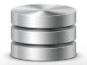

# Analysis Nodes

## Source Nodes

Source nodes allow you to add variants to your analysis either by adding samples, groups of samples, or groups of variants from within the VariantGrid database. Each source node provides options to filter the variants available.  Before changing the default filters available on the source nodes it's important to be familiar in interpreting variant zygosity and parameters (AD,DP,GQ,PL, AF) as these filters will have a marked impact on the variants displayed for analysis.

The following sections provide details of each of the different source nodes and associated filters available to curators.

### All Variants

Retrieves all variants in the database. This can be restricted to a gene, or by zygosity.

Default is to show variants with a minimum of 1 of "any zygosity" (ie HET/HOM ALT) as this removes variants with unknown zygosity or variants that are not associated with samples in the database (eg from ClinVar) 

To see all variants - "any zygosity" min to 0, but be aware that this will dramatically increase the results returned. Reference variants come from HOM_REF calls matching sample HET calls, low frequency somatic calls or multi-sample germline VCFs. 

The node returns variants at the time it was saved (this "Last saved" date in the editor). Variants are constantly added to the system, clicking save may return more results than last time.  

### Cohort

Used to add a collection of related samples, eg "control group" or "poor responders". 

VariantGrid will automatically generate a cohort for each vcf upon upload. This cohort will contain all samples in the vcf. All other cohorts need to be defined manually by the user. Once defined, a cohort will be available for selection in the dropdown menu on the cohort node. It is recommended, though not essential, that samples to be analysed as a cohort are joint-called in the same vcf where possible. 

There are two main approaches available to filter variants within a cohort:

**Parameter Filtering:** Filtering based on any combination of the variant parameters AD,DP,GQ,PL or AF. 

After each parameter is All/Any - this sets whether the parameter must be at least 1 sample or all of them. 

Note that not all vcfs will contain values for these parameters. Missing values will result in variants being inadvertently filtered from the cohort, so check your samples carefully before applying these filters.

**Zygosity filtering:** There are 3 methods for filtering cohorts by zygosity: zygosity counts, simple zygosity or sample zygosity. The selected method is the method that is expanded after the node filters have been saved. 

Parameter and zygosity filtering can be applied together, however, only one zygosity filter type (count, simple or sample) can be applied at any one time. 
By default cohorts are filtered using only the simple zygosity method: Het or Hom_Alt for ALL samples. 

**Zygosity Counts**

"Any Zygosity" = Hom/Het/Ref (ie anything other than 'unknown'). Unknown zygosity is when there is no coverage over the variant for this sample.

These counts are applied together in an AND-like manner. Warning: It's possible to set ref/het/hom alt minimums that add up to more than the number of samples in the cohort, which will always be false, and so exclude all variants.

### Classifications

The Classifications node is used to add internally classified variants to the analysis workflow.  Use the checkboxes to display variants with classifications matching the selected clinical significance. 

The 'other' checkbox includes the following: artefacts, drug response or risk factor.

If a variant has been classified multiple times with differing clinical significance it will be shown if any of the classifications match the selected clinical significance. For example, let's say the ASLX1 variant X has been classified as both an artefact and likely pathogenic (this situation may occur if a truly pathogenic variant can't be reliably sequenced on a specific platform, e.g. amplicon v capture).  In this case Variant X will be displayed if either of the artefact or likely pathogenic tickboxes are selected.

### Pedigree

Variants from a [Pedigree](../patients/pedigree.md), filtered by genotype according to Autosomal Recessive and Autosomal Dominant inheritance models.

**Autosomal Recessive:** Affected=HOM_ALT, Unaffected=HET
**Autosomal Dominant:** Affected=HET or HOM_ALT

### Sample

This node will load all variants present in a sample (equivalent to a single column in a vcf). A sample is usually one genotype (patient, cell or organism) with a set of variants.

This node is particularly useful for singleton analyses. Similar to the cohort node, a sample node can be filtered by variant parameters AD,DP,GQ,PL or AF (if available in the vcf), and also the variant zygosity. Before filtering by variant parameters make sure that they have been provided in the vcf otherwise no variants will be shown! 

### Trio

This node adds all variants present in a trio of samples. Trios need to be defined manually by the user. This includes specifing parental and proband samples, along with the affected status of the samples. Once defined, a trio will be available for selection in the dropdown menu on the trio node in the analysis workspace. It is recommended, though not essential, that samples to be analysed as a trio are joint-called in the same vcf where possible otherwise it is not possible to determine whether missing data is due to a reference call or a lack of coverage at the locus. 

Each trio node requires an inheritance mode to be selected. This selection will then filter the variants according to the zygosities as listed in the table below. Only one inheritance mode can be selected per trio node. To assess multiple different modes of inheritance add multiple trio nodes to the analysis workspace. Use the default trio analysis template to quickly construct a trio analysis. 

If "require parent zygosity" is False - parent zygosities may be "Unknown". Selecting this option will allow variants with low or no coverage in parental samples to pass the zygosity filters. Note that if the samples have not been joint-called this may also allow parental reference calls through due to missing data. 

Below is the table is "require parent zygosity" is True:

|                    | Proband      | Mother       | Father       |
|--------------------| ------------ | ------------ | ------------:|
| Recessive          | HOM ALT      | HET          | HET          |
| Dominant (both)    | HET, HOM ALT | HET, HOM ALT | HET, HOM ALT |
| Dominant (mother)  | HET, HOM ALT | HET, HOM ALT | REF          |
| Dominant (father)  | HET, HOM ALT | REF          | HET, HOM ALT |
| Denovo             | HET, HOM ALT | REF          | REF          |
| X-Linked Recessive | HOM ALT      | HET          |              |

In addition to the above modes of inheritance the trio node can be used to filter a sample to compound het variants. To do so add the trio node below an existing workflow for a sample and select the compound het mode of inheritance. This filter finds common genes with *both* "het from mother" and "het from father" and zygosity of (het from mother OR het from father) as per the table below.

Note that the placement of the compound het filter within a workflow is important. If the node input contains too many variants or artefacts, many false positive compound het calls will be shown in the trio c.het node. Conversely, if the filtering has been too stringent, real compound het variants will be excluded. 

Compound HET

|                    | Proband      | Mother       | Father       |
|--------------------| ------------ | ------------ | ------------:|
| Het from mother    | HET          | HET          | REF          |
| Het from father    | HET          | REF          | HET          |

## Filter Nodes

These nodes filter variants connected to the top of them

### Allele Frequency

Filter based on a sample's variant allele frequency (AF). If multiple samples have been used in the analysis workflow, make sure to select the sample of interest using the dropdown in the node menu. 

The AF is reported as provided by the vcf, if the AF is missing from the vcf VariantGrid will calculate the AF. Details on the source of the AF are provided in the vcf header, which can be viewed in the vcf info tab on the vcf details page (/snpdb/view_vcf/X)

### Built In Filter

The built in filter allows selection of commonly used variant classes including variants with:
* ClinVar - Variants with a ClinVar Max classification of Likely Pathogenic or Pathogenic
* OMIM Phenotype - Variants in genes with an OMIM phenotype
* HIGH or MODERATE IMPACT - Variants with a HIGH or MODERATE IMPACT as predicted by the VEP pipeline
* Classified - Variants that have been classified in VariantGrid with any clinical significance
* Classified Pathogenic - Variants that have been classified in VariantGrid with a maximum clinical significance of Likely Pathogenic or Pathogenic
* COSMIC - Variants reported in the COSMIC database (COSMIC count > 0)

### Effect

The effect node allows for quick filtering of variants based on a combination of predictions and information sets. 

To enable any of the pre-set filters, click the left checkbox then move the slider to select variants meeting or exceeding the set threshold (T). By default, if multiple filters are selected variants will be shown that meet **ANY** of the of the criteria. It is recommended to **ALWAYS** include IMPACT min = HIGH in a basic filter set as this will prevent inadvert loss of loss of function variants (frameshift/splice donor/start loss/stop gain etc.) that lack prediction data.

#### AVAILABLE FILTERS

**Impact min** 
Allow variants with an impact greater or equal to the selected [impact level](https://m.ensembl.org/info/genome/variation/prediction/predicted_data.html). Impact levels are ordered as follows: MODIFIER < LOW < MODERATE < HIGH  
For example, impact min = LOW will display variants with IMPACT = LOW or MODERATE or HIGH

The MODERATE\* filter is a special case developed to exclude missense variants. The MODERATE\* filter was designed so that curators can quickly remove tolerated/benign missense variants. **It is recommended to always use the MODERATE\* option in combination with one or more of the REVEL, CADD or Damage Predictor options to control which missense variants will be displayed.** Specifically MODERATE\* will display variants as follows:
* Any variants with IMPACT = HIGH  plus
* Any variants with IMPACT = MODERATE and VARIANT CLASS != SNV

As an example, test filtering your dataset using only the MODERATE option. You will see that all missense variants are displayed (along with MODERATE indels/substitutions and all HIGH impact variants). Many of the missense variants have low pathogenicity predictions and no other data to indicate they are deleterious. These variants are normally discarded by curators upon review. To speed up this process, now trying filtering your dataset using the MODERATE\* option + REVEL min = 0.7. Now you will see that the only missense variants displayed are those with REVEL scores greater or equal to 0.7. These are your missense variants of interest. Because you've chosen the MODERATE\* filter you'll still see indels/substitutions with MODERATE impact along with all HIGH impact variants.

**Splice min**  
Variants meeting the following criteria will be displayed:  

* dbscSNV.ADA >= T or   
* dbscSNV.RF >= T or  
* SliceAI.DL.Score >= T or  
* SpliceAI.DG.Score >= T or  
* SpliceAI.AL.Score >= T or  
* SpliceAI.AG.Score >= T or   
* is splice indel 

Where a splice indel is defined as: (splice region is not null AND variant class is not SNV). Splice indels have been included to ensure that insertions, deletions and complex variants in a splice region are not removed by the filter as these variants are not generally assessed by splicing predictors. As a rule of thumb a splice threshold of 0.2 is lenient, 0.4 moderate and 0.6 stringent. 

For further information on these splicing predictors see:  
SpliceAI: https://pubmed.ncbi.nlm.nih.gov/30661751/  
dbscSNV: https://www.ncbi.nlm.nih.gov/pmc/articles/PMC4267638/  

**CADD score min**  
CADD phred >= T

**REVEL score min**  
REVEL score >= T

**COSMIC count min**  
COSMIC count >= T

**Damage predictions min**  
sum(pathogenic predictions for variant) >= T

A prediction is considered pathogenic if it meets the following criteria:  

  * SIFT = damaging
  * Polyphen2 = possibly or probably damaging
  * Mutation assessor = medium or high
  * Mutation taster = disease causing
  * Fathmm = damaging

**Protein domain**  
If selected, this will display variants with values in at least one of the following fields:  

  * Interpro_domains
  * domains

**Published**  
If selected, this will display variants with values in at least one of the following fields:  

  * Pubmed
  * MM variant article count
  * MM variant/protein article count
  * MM aa article count
  * MM AA ID 

#### FILTERING EXAMPLES

Using the following 2 variants as an example:

| Variant            | Class        | CADD         | REVEL        | IMPACT       |
|--------------------| ------------ | ------------ | ------------ | ------------:|
| Variant 1          | SNV          | 27           | 0.4          | MODERATE     | 
| Variant 2          | DEL          |              |              | HIGH         | 
| Variant 3          | SNV          | 2            |              | MODERATE     | 

Example 1:
Filter Set: CADD 20; REVEL 0.7; IMPACT MOD  
Computed as: CADD >= 20 OR REVEL >= 0.7 OR IMPACT >= MOD  
Result: Both Variant 1 & 2 will displayed.

Advanced use of effect node filters:
Click on the required link to display required and null checkbox options. Warning: do not use these checkboxes unless you are comfortable with Boolean logic and the behaviour of null data for your selected filters. If a criterion **MUST** be met to display a variant, select the required box for each required criterion. Make sure to check the **"Allow Null"** box if results should include variants with missing data for the selected criterion. It is particularly important to check the 'Allow null' box if REVEL or CADD scores are set to 'required' otherwise all indels will be filtered as predictions are only available for SNVs. Below are some advanced examples using the variants from the table above:

Example 2: 
Filter set: CADD 20; REVEL 0.7 (required); IMPACT MOD  
Computed as: REVEL >= 0.7 AND (CADD >= 20 OR IMPACT >= MOD)  
Result: No variants will displayed.

Example 3:
Filter set: CADD 20 (required, null); REVEL 0.7; IMPACT MOD  
Computed as: (REVEL >= 0.7 OR REVEL is null) AND (CADD >= 20 OR IMPACT >= MOD)  
Result: Only variant 2 will be displayed.

### Filter

Construct your own filter based on column values. "All" means all lines must be met (AND), "Any" means any can be met (OR)

Search is case insensitive (except "in"). Some columns contain NULL (no value) which will not match anything. You may want to use "is null" to include or "is not null" to exclude them.

### Gene List

Filter to a list of gene symbols.

Used **Named Gene Lists** to select existing [Gene Lists](../genes/gene_lists.md). You can select multiple lists at a time.

This node returns variants where ANY TRANSCRIPT matches the genes in the list, see [transcript choice](../annotation/transcript_choice.md)

**Custom Gene List** - Enter symbols directly, without having to create a gene list first.

**PanelApp Panels** - Displays a list of panels from Australia/England PanelApp which you can auto-complete to select.

View the "Genes" tab to see which genes are being used by the filter.
 
### Intervals Intersection

Filter based on intersection with genomic ranges (eg .bed files), a custom range (chrom: start-end) or a HGVS coordinate.

### Merge

Merge variants from multiple sources

### Mode of Inheritance

Uses known gene/disease associations from the [Gene Curation Coalition (GenCC)](https://thegencc.org)

Disease ontology terms must be in [MONDO](https://mondo.monarchinitiative.org/) as that is what is used by GenCC

If a sample is provided, with the "strict zygosity" option, that sample's zygosity will also be taken into account. For instance if a gene/disease mode of inheritance is "Autosomal recessive" then only homozygous variants in that gene will be included.

### Phenotype

Filter to genes related ontology keywords (HPO, OMIM and MONDO). This is more lax than the Mode of Inheritance filter, as there are genes associated to a term but not definitively classified as disease causing.

You can autocomplete terms (multiple select) for exploratory analysis, however it is far better to actually [store the phenotypes against the patient](../patients/phenotypes.md). 
 
You can then select a patient to use those phenotypes (the patient must be assigned to a sample that is an ancestor to the pheno node)

View the "Genes" tab to see which genes are being used by the filter.

### Population

Most genetic diseases are rare (eg 1 in 10,000 people) so we know the disease-causing variant must also be rare. So when searching for disease causing variants, one of the first things to do is filter out variants that are common in the population.

This node filters variants by population frequency in public databases ([gnomAD](https://gnomad.broadinstitute.org/)/[TopMed](https://topmed.nhlbi.nih.gov/)/[1KG](https://www.internationalgenome.org/1000-genomes-summary/)/[UK10K](https://www.uk10k.org/)) or [internal frequency in this database](../data/zygosity_counts.md).

[PopMax](https://gnomad.broadinstitute.org/help/popmax) is the frequency of the highest sub-population (Note: gnomAD2 includes bottlenecked populations such as Finnish/Ashkenazi, while gnomADv3 excludes them)

Click "Pick individual gnomAD populations" to expand the selection to sub-populations (ancestry groups such as Europeans or East Asians).

You can also restrict to a max count (gnomAD hom alt or [internal zygosity counts]((../data/zygosity_counts.md))) which is useful to restrict to very rare variants (eg denovo) 

Internal database frequency thresholds are critically dependent on what samples are in your database, most clinical databases will be highly enriched for disease samples. If you have entered [patient phenotypes](../patients/phenotypes.md) you can see counts of disease terms on the patient page.   

### Tags

Filter variants to those that have been [tagged](tagging.md). You can select multiple tags in the auto-complete. If no tag is selected, it filters to any tag.

**Tags From** determines whether to filter to variants tagged just in this analysis ("Tags" column), or anywhere (both "Tags" and "Tags in other analyses" columns) 

**Parent Input** - When set, the node has a top connector and filters the parent node's variants. If not set, the node is a source node and retrieves all tags.

The **Exclude** option removes variants with tags - this is most often used for filtering out artefacts (All tags).

The tags icon on the toolbar allows you to quickly see all tags in this analysis, without having to make and configure a tag node. 

### Venn

A filter based on set intersections between 2 parent nodes

### Zygosity

Filter to an ancestor sample's zygosity. Multiple hit filters to variants where a minimum of 2 are present per gene.
