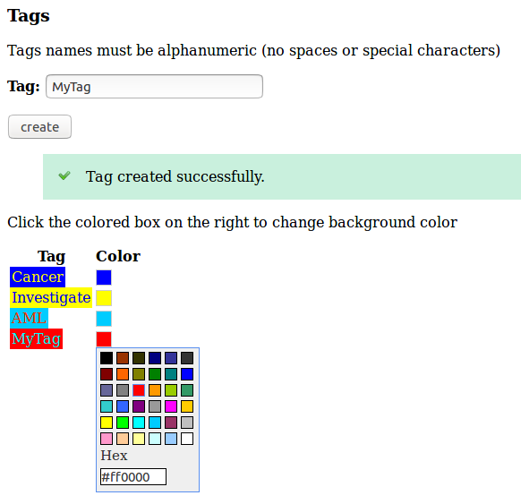
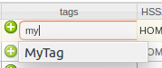
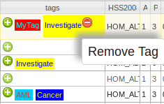
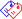
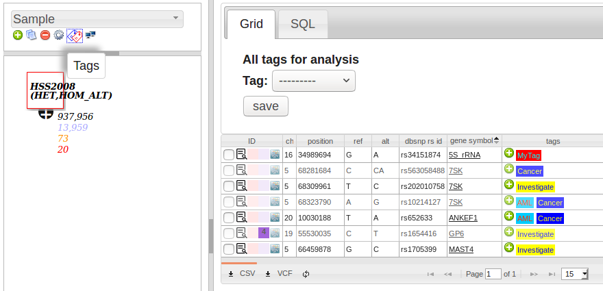
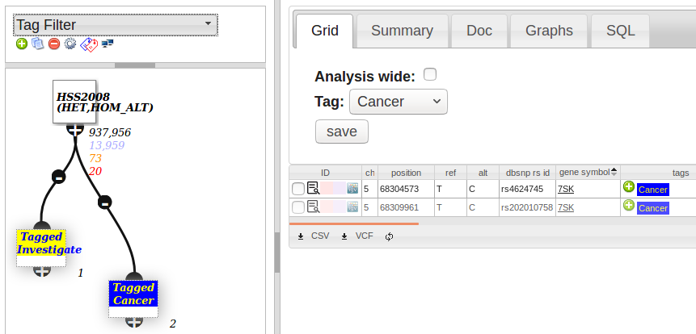

# Variant Tagging

A tag is a label (such as "Cancer" or "Investigate") which you can use to label and track variants in an analysis.

## Create tags

Menu: **[settings] -> [tags]**

## Tagging variants

In an analysis, click the  in the "tags" column then auto-complete your tag.

To remove a tag - clicking on the tag. The tag will grow in size, and a  will appear. Click it to remove the variant tag.

## Using tags

Click the  on the toolbar to view all Tags in an analysis 

To filter to specific tags - add a tag node, and use it like any other node to filter variants to just those that have been tagged.

You can view all tagged variants on a page, via menu: **[analysis] -> [Tagged Variants]]**
