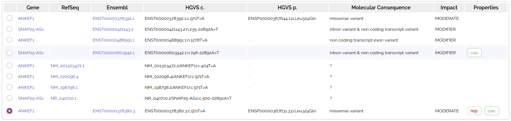
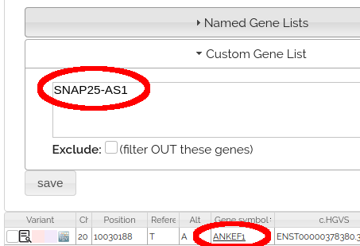

# Transcript Choice

Variants are annotated with multiple transcripts, which can give different results. 

Shown below is a variant that overlaps with two different genes (ANKEF1 and SNAP25-AS1) with many transcripts: 

## Analysis transcripts

We only want 1 row per variant in an [analysis grid](../analysis/analysis_intro.md), so a  single **representative transcript** is chosen to be displayed and filtered (see below)

You can see annotation for all of the transcripts by clicking on the 1st column in the grid to open [variant details](variant_details.md) 

Most [analysis nodes](../analysis/nodes.md) filter on fields from the representative transcript shown on the grid, so representative transcript choice can affect analysis results.

The [GeneList Node](../analysis/nodes.html#gene-list) returns variants where ANY TRANSCRIPT matches genes in the gene list, not just the representative transcript. For example, the variant at the top of this page has ANKEF1 as the representative transcript, but is returned when searching for SNAP25-AS1:

This ensures no variants are lost in gene list filters due to transcript choice, but leads to the unexpected behavior that variants may have gene names not in the gene list.         

## Representative Transcript

Chosen via [VEP pick](https://asia.ensembl.org/info/docs/tools/vep/script/vep_other.html#pick) algorithm:

1. Canonical status of transcript
2. [APPRIS isoform annotation](https://asia.ensembl.org/Help/Glossary?id=521)
3. [Transcript support level](https://asia.ensembl.org/Help/Glossary?id=492)
4. Biotype of transcript ("protein_coding" preferred)
5. CCDS status of transcript
6. consequence rank according to [this table](https://asia.ensembl.org/info/genome/variation/prediction/predicted_data.html#consequences)
7. Translated, transcript or feature length (longer preferred)
8. MANE transcript status

