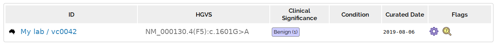

# Variant Details

This page shows the [annotation](annotation_details.md) and other information about a variant.

The top of the page has an IGV link, and a link to the allele for this variant:

An allele is genome build independent - ie hg19 and hg38 variants for same change point to same allele. The ID (CA9034) is from the [ClinGen Allele Registry](http://reg.clinicalgenome.org/redmine/projects/registry/genboree_registry/landing) 

## Classifications

This shows internal [classifications](../classification/variant_classification.md) for an allele (may have been classified against a different genome build)

The far right column contains [Classification Flags](../classification/classification_flags.md)

## Transcripts

Variant annotation is calculated for each transcripts overlapping a variant. You can select each of the different transcripts to change which is being displayed. A transcript can be labelled as [Representative](transcript_choice.md) (most damaging for variant shown on analysis grid) or canonical (transcript chosen for gene by RefSeq/Ensembl) 

## Samples

At the bottom of the page is a grid of samples that contain the variant (and the zygosity and read information). Only samples you have permissions to view are shown, but a warning will be shown informing you that samples you don't have permission to see exist.   
  

