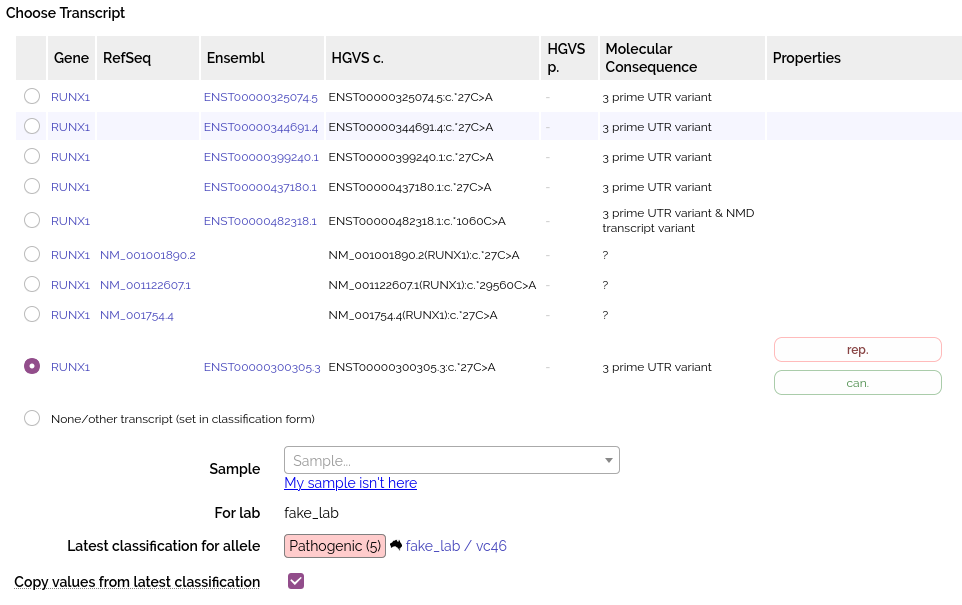

# Variant Classifications

## Creating Classifications

Create classifications as follows:

* From an analysis (see [analysis classification workflow](../analysis/analysis_classification.md))
* From an existing variant via the [variant details page](../annotation/variant_details.md)
* Via API (See [Shariant API docs](https://shariant.readthedocs.io/en/latest/integration/api/classification_post.html))
* Entering a HGVS name into the box at the top of the classifications page.  

## Create from existing variant

When you click "New Classification" from the allele or variant details page, you are shown a form to pick the transcript and sample:
 

A number of fields are auto-populated from [annotation](../annotation/annotation_details.md) and sample information (data from VCF record, patient phenotype etc).

Classifications made against a sample are linked from the bottom of the VCF and sample pages.

Variants created from the external API are not auto-populated from annotation. 

## Editing

See the [Classification Form](classification_form).

## Configuring Fields

An administrator can add/remove EvidenceKeys which are used to create fields.

They can also hide visible fields on a per-lab basis. 