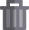

# Classification Flags

Each classification flag indiciates that there is an action that needs to be performed against the classification.

Many of the flags will be automatically raised by Shariant, though some of them you will be able to open yourself.

To look at the details of a specific open flag, simply click on it to be taken to the flag dialog.

## Flag Dialog

From the flag dialog you can view summaries about what flags are currently open, see a list of flags that have been resolved as well as raise new ones.
Note that only important flags still show up when closed, e.g. suggestions and internal reviews and a few others.

In the provided screenshot we can see we have an open flag asking us to share the classification, a completed internal review, an accepted suggestion and a rejected suggestion, as well as the buttons to create new internal reviews and suggestions.

You can visit the details of an open flag, or a closed one by clicking on the icon.

From the details page of an open flag, depending on the type of flag, you can add a comment and potentially change the status of a flag.

You can raise a new flag by clicking on one of the icons near the bottom with a plus button.

(The kinds of actions you can take on flags will depend on if you're looking at a classification from your lab or another lab.)

See below for flags and how to solve them:

## Flag Types

###  Discordance
This classification is in discordance with one or more classifications.
1. Ensure that you have completed an internal review of your lab's classification recently (within the last 12 months is recommended). If not, raise the internal review flag and complete an internal review of your lab's classification.
2. Review any outstanding suggestions against your lab's classification.
3. View the other classifications in the discordance report and view the evidence differing between multiple records via the diff page. If appropriate, raise suggestions against other lab classifications.
4. This Discordance flag will automatically be closed when concordance is reached.

This is discussed in the [Classification Discordance](https://shariant.readthedocs.io/en/latest/site/classification_discordance.html) page.

###  Internal Review
This classification is marked as currently being internally reviewed.
1. Once the internal review is complete, ensure you update the classification in your curation system.
2. Mark the internal review as Completed.

This is discussed in the [Classification Discordance](https://shariant.readthedocs.io/en/latest/site/classification_discordance.html) page.

###  Matching Variant
This variant has not been seen in this system previously.
It should be linked to a variant given time.

###  Matching Variant Failed
We were unable to normalise the variant provided based on the c.hgvs and genome build values.
1. Please contact Shariant support for help in resolving this.

###  Outstand Edits
Edits have been made to this classification that are not included in a published version.
1. From the classification form, ensure there are no validation errors stopping this record from being published.
2. At the bottom of the form, click the tick to submit the outstanding changes.

###  Significance Changed
This classification has changed it's clinical significance compared to a previously published version.
1. Set the status of this flag to reflect the primary reason behind the change in classification.
2. Please also add a comment providing some context.

This is discussed in more detail on the [Classification Discordance](https://shariant.readthedocs.io/en/latest/site/classification_discordance.html) page.

###  Suggestion
Someone has raised suggestion(s) against this classification.
1. Review the contents of each suggestion.
2. If appropriate, make changes in your curation system and mark the suggestion as Complete.
3. If you decline the suggestion, mark it as Rejected.

###  Unshared Classification
This classification is not yet shared outside of your lab or institution.
1. From the classification form, ensure there are no validation errors stopping this record from being published.
2. Review the content of the classification to make sure it's ready to be shared.
3. At the bottom of the form, click the Share to submit at a higher share level.

###  Withdrawn
This classification has been marked as withdrawn. It will be hidden from almost all searches and exports.
1. If the classification is not of high enough quality or in error, you may leave it as "withdrawn" indefinately.
2. If you wish to un-withdraw the classification, click the open bin icon in actions from the variant classification form.
(Note you can't open a Withdrawn flag, but you can Withdraw/Unwithdraw from the classification form)