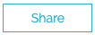
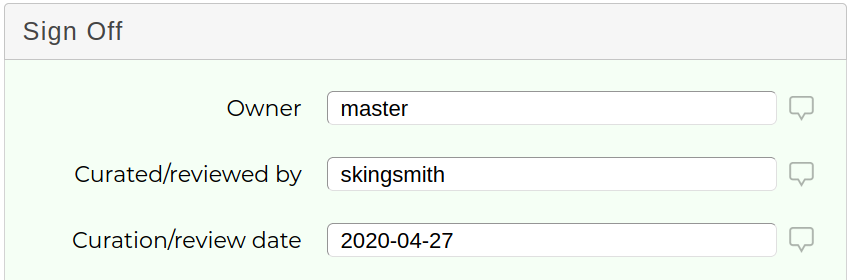
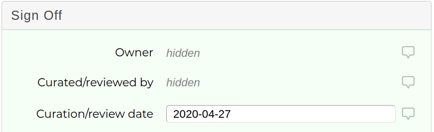

# Classification Sharing

### How to share 

A classification submitted without errors can have its visibility increased by clicking the  at the bottom of a classification. You can increase share levels, which are:

* **Lab**
* **Organisation** (your research institute or company if they have multiple labs)
* **Shariant Users** (sends to Shariant)
* **3rd Party Databases** (sends to Shariant & to further public databases)

Share levels can only be increased, and each level also includes all previous levels, see [Shariant doc on sharing](https://shariant.readthedocs.io/en/latest/integration/basics/sharing.html). The last two levels mean classifications can be sent to external systems.  

### External systems

VariantGrid integrates with [Shariant](https://shariant.org.au), the Australian Genomics Variant Classification Sharing Platform, which helps labs meet sharing best practices, and [alerts them if another lab classifies a variant differently](https://shariant.readthedocs.io/en/latest/site/classification_discordance.html).   

If enabled (currently clinical diagnostic only, not research servers), the system will regularly check for classifications with *Shariant Users* / *3rd Party Databases* share levels and automatically send them to Shariant.

*Warning:* You can only increase a variant's share level, not reduce it (eg as someone may have seen and copied it) 

### Private fields

Some [evidence keys](https://shariant.readthedocs.io/en/latest/integration/evidence_keys/overview.html) have a “max share level” and are never shared beyond that level, regardless of the overall classification share level.

For instance __curated_by__ and __curation_verified_by__ have a max share level of institution, which means only your users can see them. Users from other organizations can see the classification was from your lab, but not who did the curation.

**What your institute sees:**

**What others see:**

### Withdraw

You cannot delete a classification that has been shared, but you can "withdraw" it. 

This will remove the record from most listings and search results, but will not remove it from any Discordance Reports that it had been involved in (it will no longer be a part of discordance calculations).

When a record has been withdrawn it can be unwithdrawn by clicking the same button (it should look like a rubbish bin with a raised lid now).
