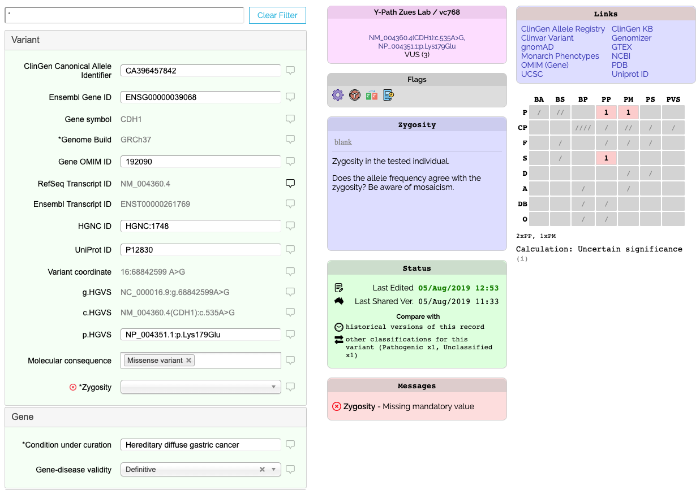
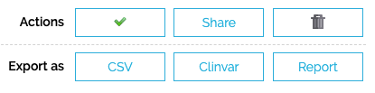

# Variant Classification Form

The Classification Web Form can be used to create and edit classifications directly within VariantGrid.

### View

To quickly see all fields that have values for a classification, enter "*" into the filter box at the top of the classification.
To see all possible fields, enter "**" in the filter box.
To find an individual field, start typing the label of the field into the filter e.g. "gnomad".

### Identify Errors

A record might not be shared as there are outstanding validation errors. In the Messages box on the form it will list any errors. If possible fix those errors in your curation system and then they should be fixed on the next sync.

### Change History / Diff

Each version of a record published in VariantGrid is recorded, by clicking on "Compare historical versions of this record".

If there are other classifications for the same variant, there will be a link to compare them there too.

### ACMG Guidelines

The classification form has fields for the ACMG Guidelines, e.g. PM4, BA1 - the meaning of each is given in the help.
See [Guidelines](https://www.acmg.net/docs/Standards_Guidelines_for_the_Interpretation_of_Sequence_Variants.pdf)

VariantGrid displays a grid of ACMG fields with each row being a category of data, and each column representing the strength of evidence for benign or pathogenic.
* The number of met criteria for a given box will be shown as a number.
* Explicitly unmet criteria will show as "/"s.
* Criteria not yet marked as met or unmet will show as "?"s.

The various values will be plugged into the ACMG formulae and a recommended overall clinical significance will be displayed.
This calculated value has no affect on any of the data, the user is still able to set the overall clinical significance to whatever (hopefully justifiable) value they like.

### Actions

At the bottom of the form there will be a list of action buttons.

The Tick icon re-submits the classification at its current change level. For any manual changes to be seen, this button will need to be ticked.

Next to it is a Share button that allows you to increase the scope of who can see the classification.
Important, increasing the Share level is not un-doable.
The share levels are
* Just your lab
* Anyone within your organisation (if your organisation has multiple labs)
* All Shariant Users
* 3rd Party Databases (this will allow us to upload the record to Clinvar at a later date)

### Delete / Withdraw

If the classification has only been shared at the lab or organisation level, you are able to perform a hard delete on the record.
If it has been shared, instead you have the option to "withdraw". This will remove the record from most listings and search results, but will not remove it from any Discordance Reports that it had been involved in (it will no longer be a part of discordance calculations).

When a record has been withdrawn it can be unwithdrawn by clicking the same button (it should look like a rubbish bin with a raised lid now).

### Export

You can also export the single record as CSV, a preview of the Clinvar format or as a report.
(The report does require that your lab has a report template pre-configured.)

### Literature Citations

Any PMID references in the form of PMID:123456 from anywhere within the classification will be summed together and listed at the bottom of the classification.