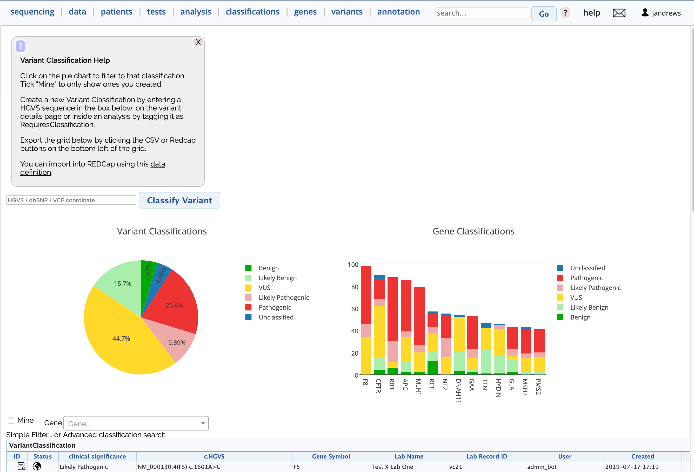

# Variant Classification REDCap

Variantgrid supports the exporting of Variant Classification data into REDCap files.
Note that this is currently the full extent of REDCap integration with Variantgrid, there is no support for importing REDCap records or exporting any other kinds of records in a REDCap format.

There are two parts to the REDCap export.

## REDCap Definition

The data definition is available by opening the page help on the classification page.

The definition is dynamically generated from the variant classification evidence key configuration. We do our best to ensure that changes to evidence keys are backwards compatible for REDCap definitions.

The definition is laid out in such a way that up to 10 records can be grouped together in one record
e.g. `vc_zygosity_1, vc_zygosity_2, vc_zygosity_3 up to vc_zygosity_10`
This is so that variants for the same patient can be consolidated.

Note that the REDCap definition is primarily used as a read only representation of the data, doing large edits of data in REDCap is not recommended.

## REDCap Rows

**Important:** Variant Classifications will ONLY be exported if `REDCap Record ID` has a value.
All rows that do not have a value for `REDCap Record ID` will be ignored in the export.

At the bottom of the classification table there will be a CSV and REDCap download button.
Clicking the REDCap download will download records that are:
* Available in the current filter (if the results are split over multiple pages all will be downloaded). For example if you filter to show "Mine" the records in the download have to belong to you.
* Have a value for `REDCap Record ID`.

Records that have the same `REDCap Record ID`, regardless of any other factors, will be grouped together as described earlier, re `vc_zygosity_1, vc_zygosity_2` etc

## Technical Specifics

| Evidence Keys | REDCap type |
| ------------- |:-----------:|
| boolean       | yesno |
| select or ACMG criteria | dropdown |
| textarea | notes |
| date | text (with formatted as dmy with validation) |
| everything else (including multi-select fields) | text |

This means while single drop down fields work as you'd expect, multi-drop downs produce text that's harder to report on.

The evidence key definitions for selects have an explicit index for each drop down option. If adding more options (regardless of insertion order) a new index should be assigned and existing options should retain their index. This is to help keep newer REDCap definitions compatible with older REDCap records.
