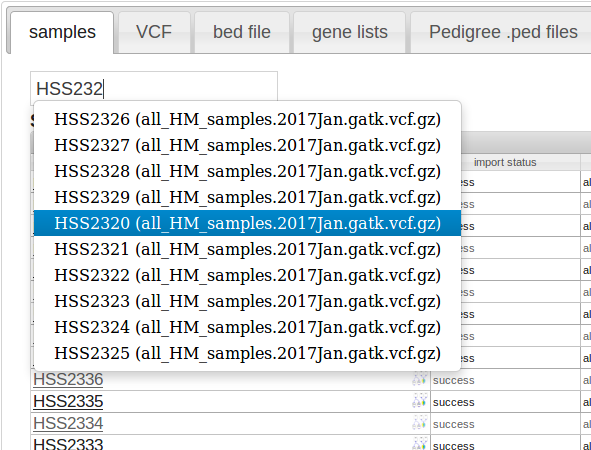
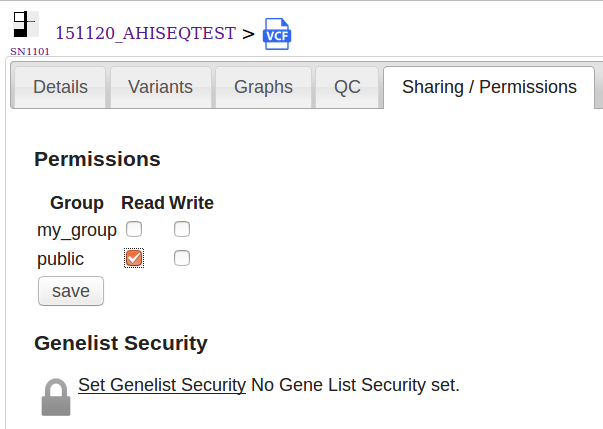

# Managing data

Menu: **[data]**

The data page displays all of your uploaded data such as (VCFs, Bed files, Pedigree Files etc)

Data is displayed in grids, with each data type in a separate tab.

You can enter parts of the name into an autocomplete search box to quickly find your files:

Click the link on the grid to view the file details page.

## Sharing data

Users belong to groups (see [user settings](../settings/user_settings.md)) that can share data. Ticking the **Show Group Data** checkbox will show this on a grid.

By default, you automatically share data (read-only) with your group.

To change data permissions, click the **[Data/Sharing]** tab:

**logged_in_users** is a special group - and means everyone who has a VariantGrid account.

## Search

Enter text into the search box in the top right hand corner and press enter or click Go.

Accepted inputs:

| Name | Example |
| ---- | -------:|
| Locus | chr1:169519049 |
| Variant | 1:169519049 T>C |
| ClinGenAllele | CA285410130 |
| dbSNP ID | rs6025 |
| HGVS | "NM_001080463.1:c.5972T>A", "NM_000492.3(CFTR):c.1438G>T", "NC_000007:g.117199563G>T" |
| Gene | GATA2, ENSG00000179348 |
| Sample | hiseq_sample_2 (case insensitive search match in name) |
| Flowcell | 160513_NB501009_0029_AH3FFJBGXY |

### HGVS

We use [PyHGVS](https://github.com/counsyl/hgvs) library for parsing HGVS names, which supports 'c.', 'n.' and '.p'.
