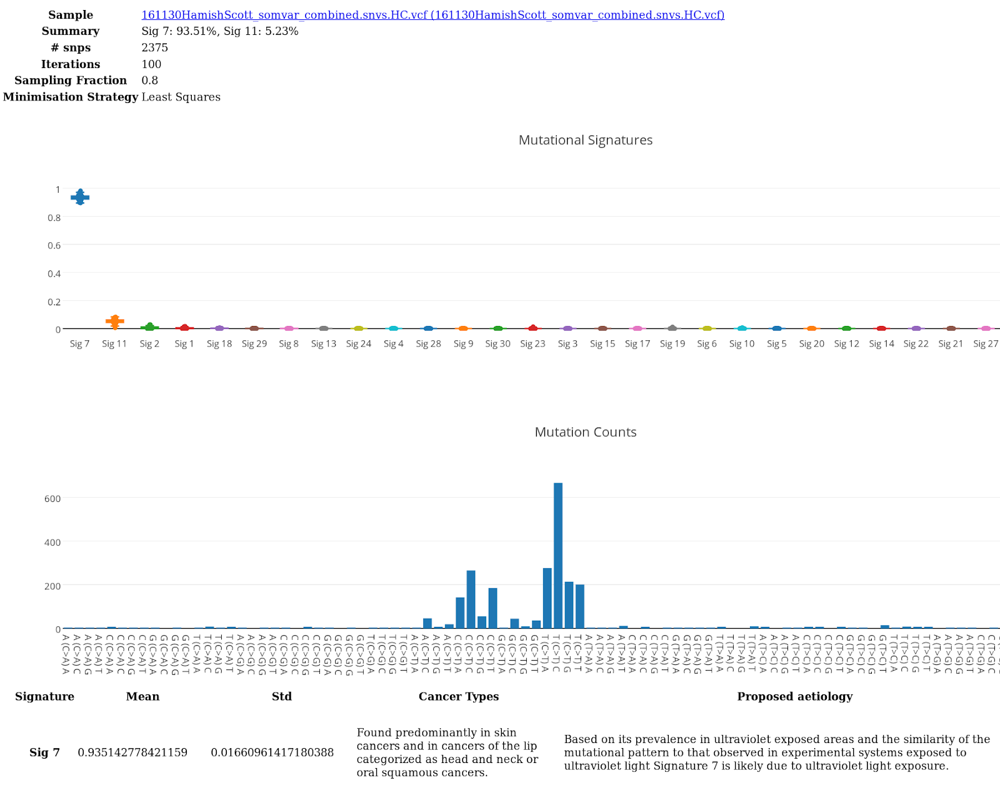

# Mutational signatures

The type of somatic mutations present in a cancer sample can provide insights into the underlying molecular mechanisms driving oncogenesis. For example, cancer caused by tobacco exposure will result in an increased number of C>A transversions compared to cancers unrelated to tobacco. The advent of large cancer datasets has identified at least 21 conserved mutation signatures indicative of exposure or defective DNA damage repair mechanisms. For further details see  [Signatures of mutational processes in human cancer, Alexandrov et al 2013](https://www.nature.com/articles/nature12477)

VariantGrid will automatically run mutation signature detection at vcf upload, but only if the vcf is detected as a somatic only (germline substracted) sample. This can be defined in the vcf header by ##source=combine_caller_data. It is not possible to manually run mutation signature analysis in VariantGrid once the vcf has been uploaded.

To view a mutation signature report go to:  
Menu: **[data]** -> Sort samples grid by "Mutational Signature" column -> Click on entry.  
Or click on the link in the "Mutational Signatures" at the bottom of the sample page.    

In the example report below, the top graph indicates the percent composition of each mutation signature assessed. The bottom graph illustrates the frequency of each mutation type. In this example, the predominant mutation signature is found to be associated with UV damage. 

Thanks to Paul Wang from the ACRF Cancer Genomics Facility for the code. 
