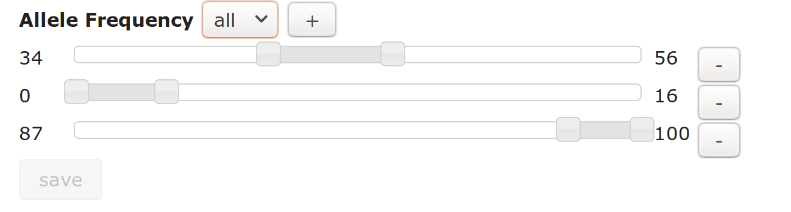

# Somatic data

[Somatic VCFs](vcf_samples.md) detected as somatic only (tumor minus normal) are analysed for [mutational signatures](mutational_signatures.md)

## Allele Frequency

We do not import the AF value from the VCF, but instead [normalize](../variants/normalization.md) the data then recalculate AF to be ```AD / sum(AD for all variants at locus)```

In an analysis, Sample, Cohort and Trio nodes can filter by allele frequency. For the Cohort and Trio nodes, **all** or **any** refers to requiring all samples to have allele frequency within the ranges or just one or more sample.     



