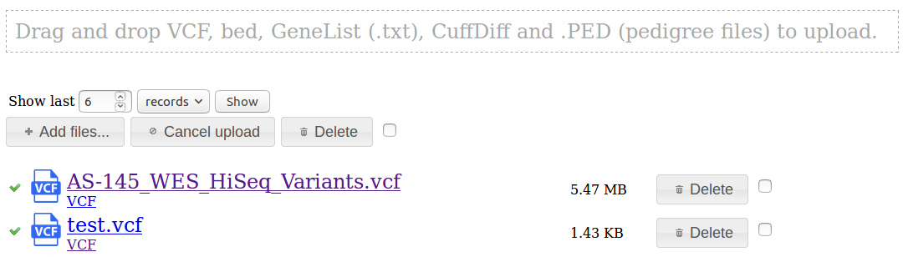

# Uploading Data

Menu: **[data] -> [upload]**

You can either drag & drop files onto the page, or by selecting **[Add Files]** button. 

After the file has been transferred to the server, a spinning icon will appear as the file is processed. The large link (eg "AS-145_WES_HiSeq_Variants.vcf") takes you to the import processing page if you'd like to monitor the progress.

Once it has been successfully imported, a link will appear beneath the file (eg the "VCF" links above) allowing you to jump to the data page for this file.

