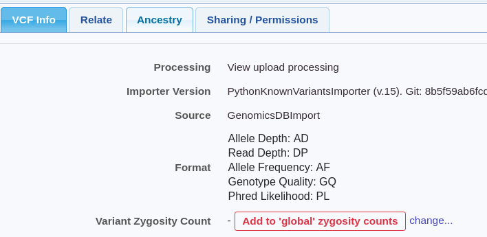

# Zygosity counts

VCFs with samples contain genotype calls (UNKNOWN/REF/HET/HOM ALT)

We store zygosity counts from for each variant for the samples in a VCF. This is used by the CohortNode to filter by zygosity and display the "hom count" and "het count" columns.

## Global Counts

These counts are also stored globally - ie zygosity counts from a VCF can be added when it is uploaded, and subtracted if it is deleted. 

This is available on the grid as "database HOM count" and "database HET count" columns, and by the PopulationNode to "Filter based on samples in this database"

## VCF configuration

An administrator can configure whether VCFs are added to the global count based on the VCF header or EnrichmentKit, for instance to ignore duplicate VCFs or only store germline samples. 

You can see if a VCF is part of global zygosity counts by going to the VCF page, then the VCF Info tab, and the **Variant Zygosity Count** entry.

You can manually add/remove the VCF by clicking "change..." then hitting the button.

