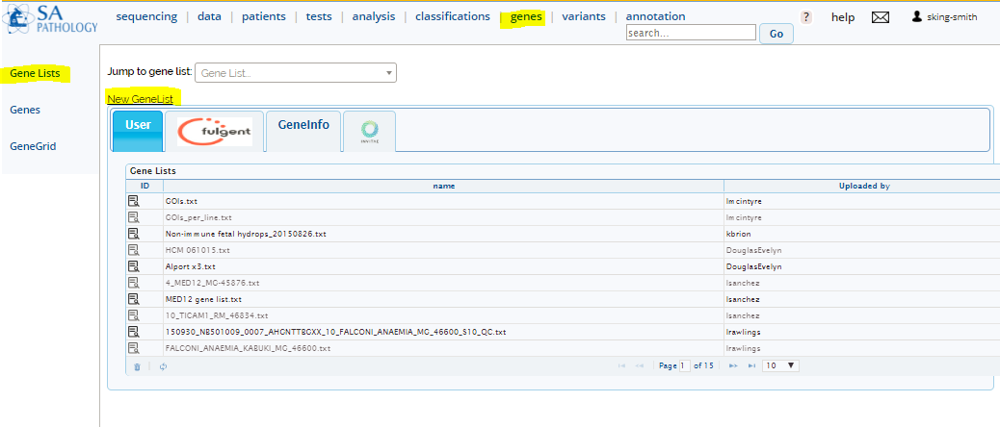
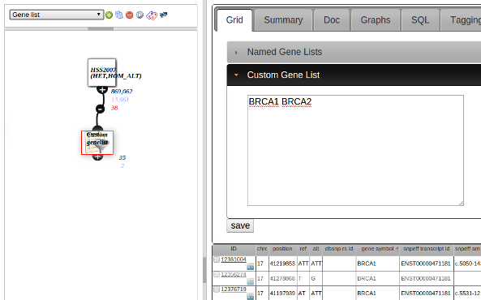

# Gene Lists

Menu: **[genes]**

## Creating Gene Lists

Ways to create a gene list include:

* Upload a text file (see [upload](../data/upload.md))
* Create via [GeneGrid](genegrid.md)
* Creating manually (see screenshot below)

## Using gene lists in an analysis

In an [analysis](../analysis/analysis_intro.md):

1. Add and connect a [GeneList Node](../analysis/nodes.html#gene-list)
2. In the node editor - select a previously created gene list in **Named Gene Lists** or enter gene symbols directly via **Custom Gene List**
3. Click "Save" to filter to those genes
4. You can see what genes are in the list in the "Genes" tab of the node editor

