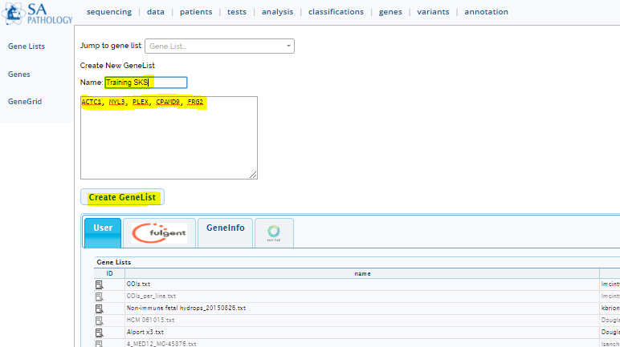

# Gene Lists

Menu: **[genes]**

* Upload a text file (see [upload](../data/upload.md))
* Create via [GeneGrid](genegrid.md)
* Creating manually (see below)

## Creating Gene Lists

## Using gene lists in analyses

To quickly filter to a gene list in an [analysis](../analysis/analysis_intro.md)

* Add and connect a gene list node
* Select "Custom Gene List" in the top right node editor
* Enter the genes into the text box and click "Save" 

