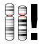

# Gene Grid

Men: **[genes] -> [gene grid]**

GeneGrid allows comparison between many different gene lists and quickly adding/removing genes. Genes are rows and gene lists are columns.

### GeneGrid screen

You can copy/paste the URL at any time to re-create a particular comparison.

Choose lists from the top left select boxes, or manually paste in gene names into the **Custom Gene List** text entry box. Click the  to remove a gene list column.

In the top right are optional evidence columns which provide information about genes.

See [Gene Coverage](gene_coverage.md) for details on how the **% at 20x** values in the Enrichment Kit columns are calculated. Enrichment kits are automatically added when a [pathology test](../pathtests/pathtests.md) that uses it is added to the grid.

### Gene Info

Small icons next to gene names on the left of the grid indicate the gene has one of these attributes:

