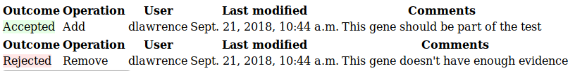

# Pathology Tests

**Note:** This is a diagnostic specific feature which may not be enabled on all systems

Menu: **[tests] -> [manage tests]**

Pathology Tests are curated, versioned gene lists offered as a diagnostic test. There can be multiple versions of a test.

A Pathology Test Version is a specific versions of a pathology test.

## Active tests

Each pathology test has at most one currently active test - the one available for test orders.

An active test is the most recent confirmed version of a pathology test.

The curator confirms & adds a time-stamp by clicking the **Confirm Test** button. Once a test has been confirmed it cannot be modified, and any further changes must create a new test version.

## Requesting gene changes

Only the curator can modify a test, everyone else can make modification request but these must be approved by the curator. Contact an administrator to change curator for a test.

Make gene modification requests on the [GeneGrid](../genes/genegrid.md) page.

The gene symbols in the pathology test column are always what is in the test. The +/- numbers (green background for add, blue for delete) in the image above are counts of requested additions/removals for that gene.

_To request a gene addition:_ Add genes to the [GeneGrid](../genes/genegrid.md), then click on an empty space where the gene should be.
_To request a gene deletion:_ Click on an existing gene, then the red delete symbol which appears.

In both cases a box will appear where you can enter a brief justification of the request. Only put a brief summary - please put in depth evidence such as linking a disease with a gene or adding literature on the gene page (click on the the gene name on the left column of the grid to open gene page in a new window).

## Accepting gene changes

The curator can see any pending requests on the pathology test version page, where they can accept/reject them.

Any genes added will have the user, date and brief justification comment from the addition request stored on the "Modification info column" which you can see on the grid of genes for a pathology test version.

The outcomes for any processed requests can be seen by all users at the bottom of the page:

