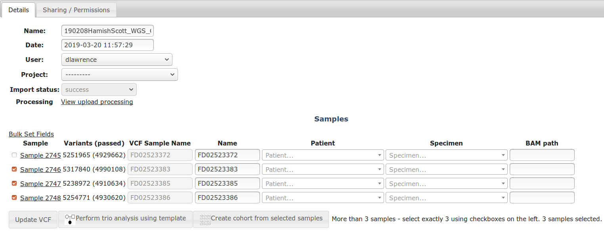
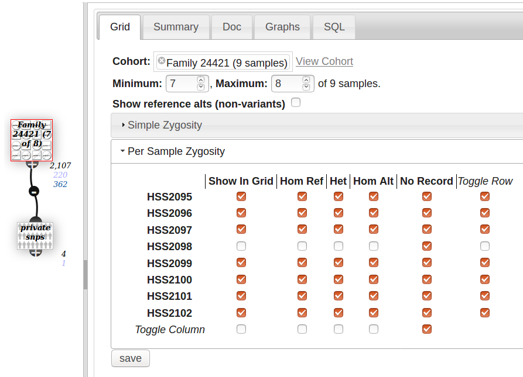
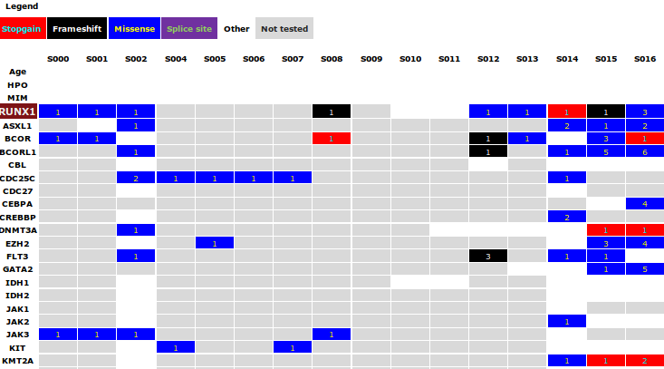
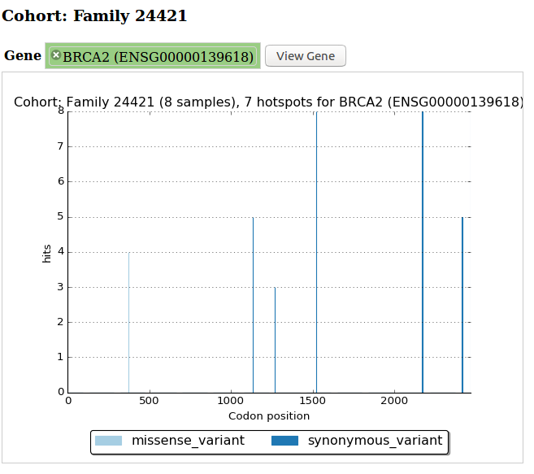

# Cohorts

Menu: **[patients] -> [cohorts]**

A cohort is a collection of samples, which you can analyse as a group. A multi-sample VCF automatically becomes a cohort, but you can create your own to organise your own samples.

### Create a new cohort

From the cohort page, enter the name of a cohort and click the **Create** button.

This opens the Add/Remove samples tab. Add samples to your cohort by auto-completing sample names in the Enter to add box, or filter the grid, select the checkbox to the left of a sample, and click the green arrow to add, or red button to delete.

Once you have finished adding/removing samples, click save. This processes the cohort so it can be used in analyses.

### Create from a larger cohort

You can create a smaller cohort from a larger one. Select at least 2 samples then click the **[Create cohort from selected samples]** button. Selecting exactly 3 samples allows you to create a [Trio](trios.md) which allows for simpler analyses.

### Cohort Analyses

Use the Cohort Node to filter by counts within the cohort (eg in 7 out of 8 of the samples) or zygosity. (see screenshot below).

Quickly create an analysis using the cohort by clicking "Create new analysis for cohort" on the details tab of the cohort page.

There are some other analyses you can perform from the cohort/VCF page, eg:

