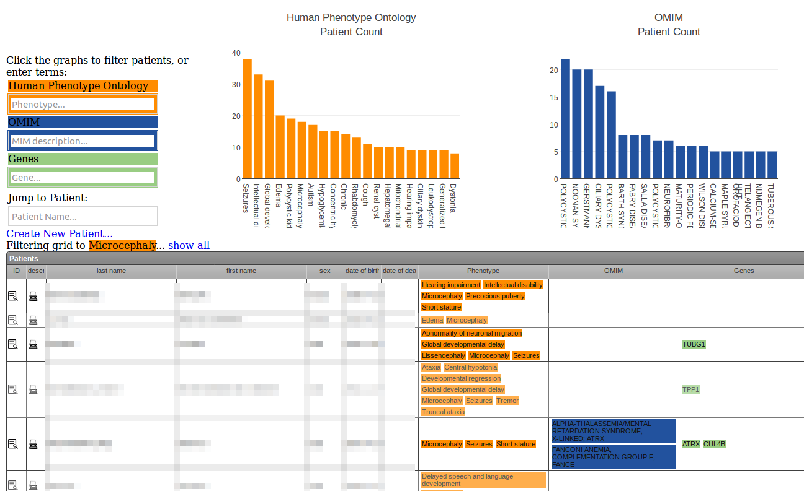

# Patients

Menu: **[patients]**

Create patients to store phenotype information and link multiple samples (eg tumor/normal) together.

## Searching

You can search by name, code or free text in the phenotype description.

Click the graph of phenotype terms to filter the grid to patients with that [phenotype](phenotypes.md).

## Patient records

Import a CSV to create patients in bulk. Click the **patient record imports** link at the top of the page, then can select to download an example CSV with your samples pre-filled, so it's easy to match your patients to your existing data.

You can also create patients one at time via a form, by clicking the **Create New Patient** link just above the grid.

## Other sources of patients

Patients can be created via the patholoy test ordering system.

On a private server (eg diagnostic lab intranet), patient records can be automatically created via your LIMS/Patient records system (speak to your administrator)

## Other

**Family Code** is useful for linking together patients

The system can be configured to show/hide names, or convert birthdates to years depending on your privacy needs.

