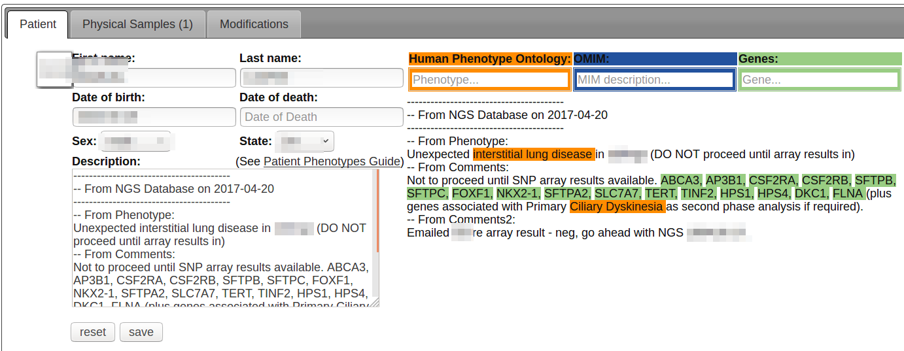

# Phenotypes

It is useful to store phenotypes, diseases and genes for a patient. Having this information well structured and using controlled terms is very useful as it allows us to:

* Filter variants to genes associated with a disorder
* Know phenotypes for patients that share variants
* Perform analyses across disease cohorts (is the same variant or gene responsible for the disease or are they different?)
* Track per-disease solve rates 

### Assigning Terms to Patients

You can auto-complete terms in the boxes, which will be added to the bottom of the patient description.

Or, you can type plain text and we'll automatically match your words to Human Phenotype Ontology, OMIM and Gene Names.

Matched terms will be highlighted to the right of the description box.



### How phenotype term matching works

Everything after "--" on a line is ignored and can be used for comments.

The text is broken up into sentences based on punctuation and new lines.

The sentence is separated into words, and then sub sets of the words in order are created, and sorted largest to smallest. For instance:

```
The cat sat on the mat
cat sat on the mat
The cat sat on the
sat on the mat
cat sat on the
The cat sat on
The cat sat
on the mat
sat on the
cat sat on
the mat
cat sat
The cat
on the
sat on
mat
the
sat
cat
The
on
```

This allows us to find the biggest matches first. If a match occurs, the unmatched parts of the sentence continue to be searched until there is nothing left. If no match occurs for a sentence, we try the next smaller one.

Some filtering is done to avoid matching to common words and terms. For instance "Trio" is a gene name, but we will not match it as a gene if the sentence also contains the name of a enrichment_kit or one of the words: "exome", "WES", "father" or "mother".

Matching occurs first against [Human Phenotype Ontology](https://hpo.jax.org/app/) terms and synonyms, and [OMIM](https://www.omim.org/) terms and aliases.

If no exact match is found, we try again using mismatches - 1 mismatch (including insertions/deletions) is allowed for two or more words.

For single words, we only allow mismatches if the word is more than 5 letters long and made entirely of letters (ie no digits or symbols).

Single words are then matched (exact with no mismatches) to gene names.

Sometimes there will be multiple matches, eg "PKD1" will map to both the OMIM term PKD1 (POLYCYSTIC KIDNEY DISEASE 1) and the gene PKD1. This is usually what people want as the gene is associated with the disorder. 
