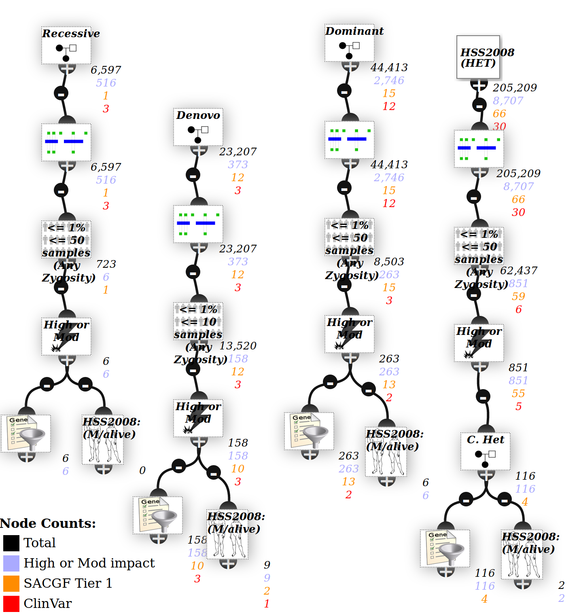

# Trios

Menu: **[patient] -> [trios]**

A trio is a collection of 3 samples (mother/father/proband) which are frequently analysed together in high throughput sequencing, as they have a number of standard analyses.

## Creating a trio

It is far better to upload a trio within the same [multi-sample VCF](../data/vcf_samples.md). If not, you must first create a cohort containing the 3 samples/

View the VCF or cohort, select exactly 3 samples then click the **[Perform Trio Analysis using template]** button.

The Trio wizard will now open, showing the 3 samples and patient / phenotype info. Assign samples (1 each to mother/father/proband) and check mother or father affected if they also have the disorder.

## Digital karyomapping

By checking a trio's zygosity, it's possible to perform a number of relatedness calculations, see [karyomapping](../analysis/karyomapping.md).

A genome-wide count is automatically performed, and a summary provided on the trio page - this is useful for checking for sample mix-ups. 

## Trio inheritance analysis

An analysis is created using different inheritance models (see below). If either parent is affected it will also use an autosomal dominant inheritance model.

The phenotype at the bottom uses the proband patient phenotypes, and sample gene lists.

### Require Zygosity Calls

By default, the filters are strict and require zygosity calls in all patients - for instance the recessive inheritance model requires a variant to be HOM in proband and HET in both parents.

However that may be overly strict - one parent may have low coverage, with no variants recorded at that locus.

Click on an Trio node to open the editor - unchecking the **require zygosity calls** box is less strict and allow for variants that are missing due to low coverage.

### Compound Het filter

Compount heterozygous means 2 variants in the same gene from different parents.

The C. Het node in the bottom right of the screenshot above is a filter node - ie it has another node connected to the top, while the other inheritance models do not.

This is because you probably don't want every gene with >=2 variants, but rather only >=2 damaging/rare ones. Adjust the filters above the C.Het node to adjust this.

Modify the analysis as per instructions below to filter to all of them.
