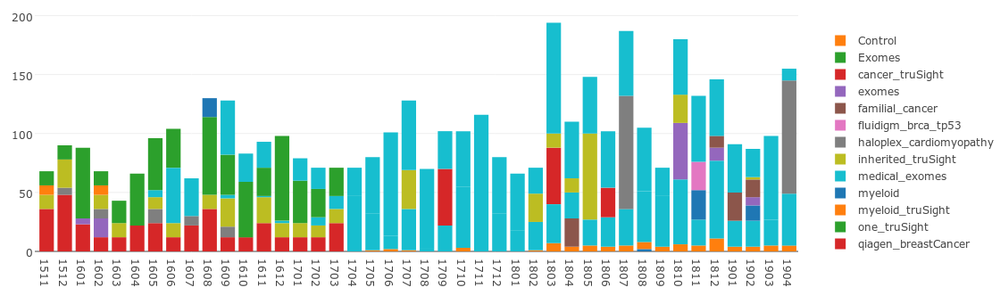
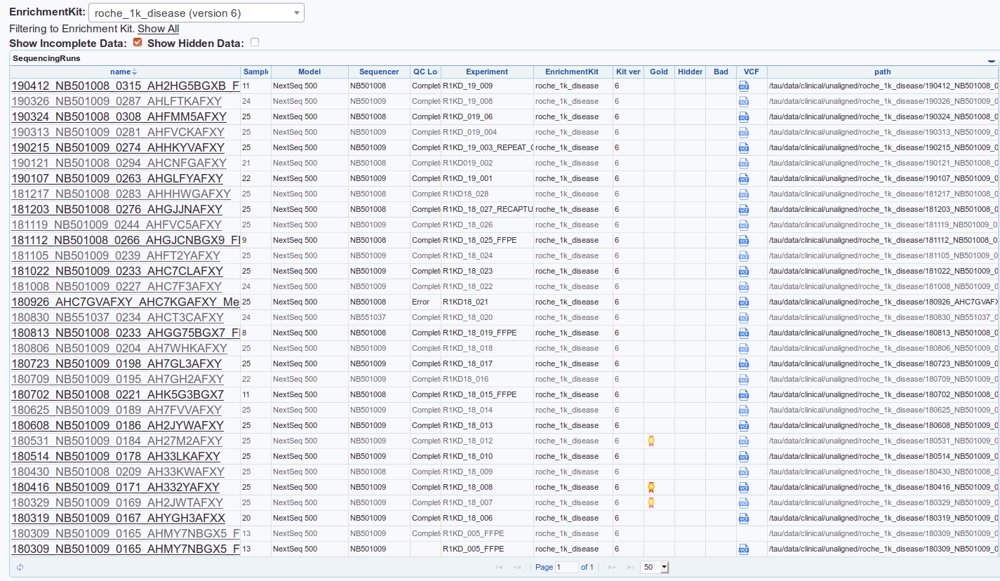
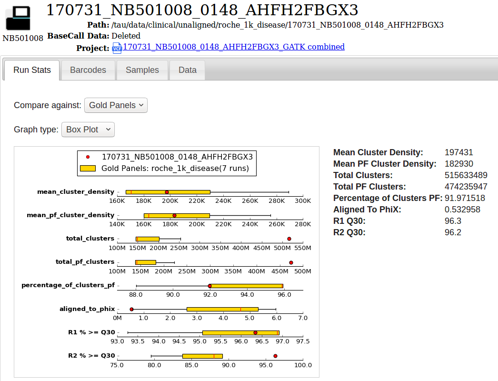

# Sequencing Runs

When VariantGrid has access to a network drive (eg a diagnostic lab intranet) it can scan disks for sequencing runs to collect QC metrics, gene coverage and automatically load VCFs. [sequencing_details](More information on sequencing features)

We collect Sequencing QC metrics and allow display it with interactive graphs. Collecting data over time allows us to see how this run compares to other runs over time (or gold standard runs).
 

