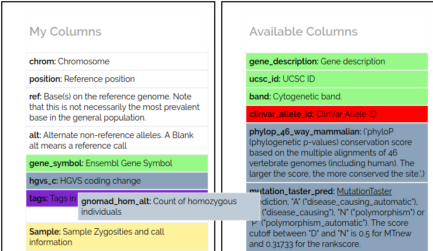
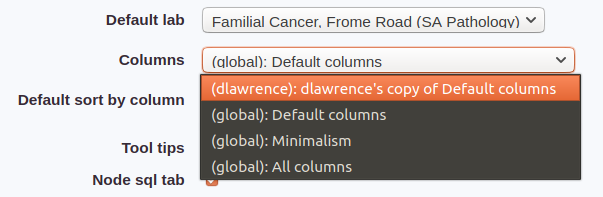

# Customise columns

You can customise the columns that appear in an analysis grid.

To create a new set of columns, visit the **Customise Columns** (**[user name]->[customise columns]**) page.

You can't modify built-in custom columns, as they are shared by everyone. Click the **[Clone...]** link on the custom columns grid to make a copy and edit it. 

## Changing columns

The customise columns page shows grid columns as blocks, which you can drag & drop to add and remove, or change order. 

Columns in "My Columns" are in this set, while unused columns are in "Available Columns". The screenshot below shows the user adding the "gnomad hom alt" column after "tags".

The order of columns (top to bottom) determines the left to right order in the grid. 

## Default columns

New analyses are created with columns set to your default columns, which you can change on the [user settings](user_settings.md) (click on **[user name]**) 

## Changing columns in an analysis

In an analysis click the  to open
the [analysis settings](../analysis/analysis_advanced.md) page, where you can select columns from a dropdown.

