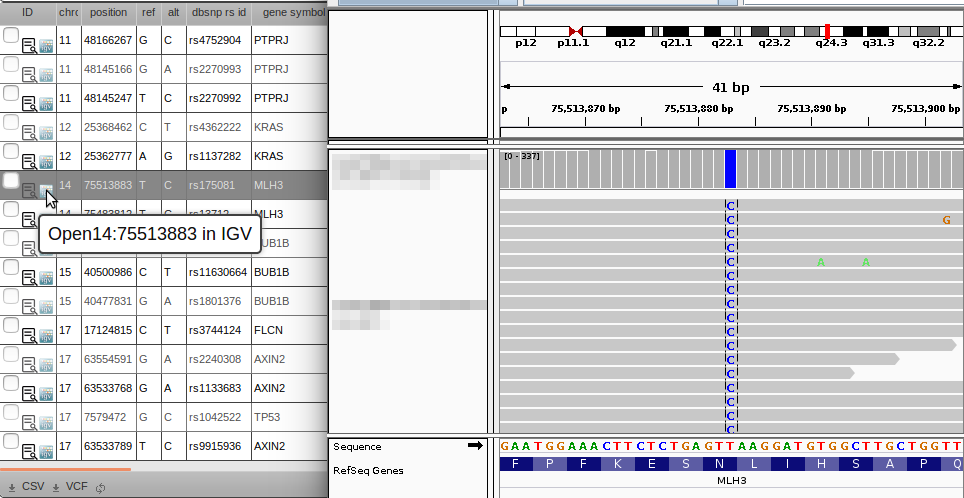
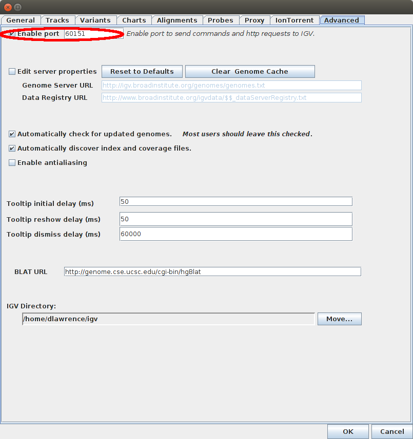
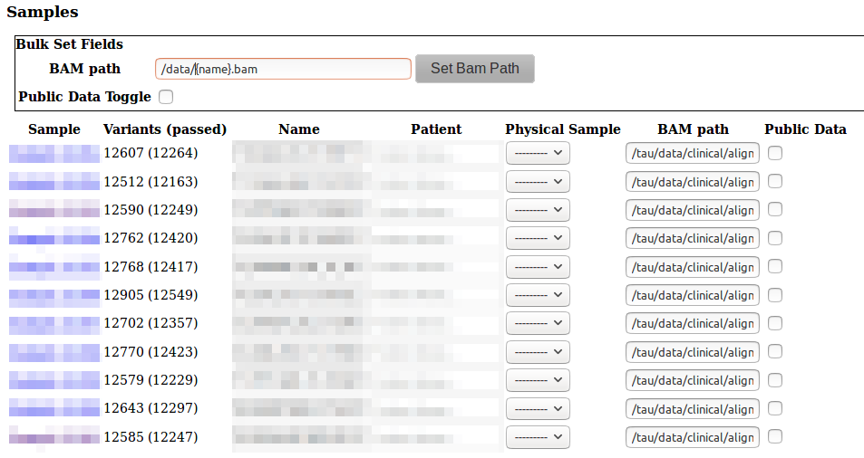

# IGV integration

Click the  to automatically jump to your variants + BAM files in IGV.

### IGV Configuration

IGV needs to be running, and have the Enable Port option ticked.

To check this open preferences in the IGV menu: **[View] -> [Preferences] -> [Advanced] Tab**.

### VariantGrid Configuration

If the value of the IGV port is different from **60151** (default), you need to change the IGV Port option in your [User Settings page](user_settings.md).

Clicking the IGV link () will jump to the locus, and show BAM files associated with input samples (Sample or Cohort ancestors). These are the same samples that have their zygosities/allele depth shown on the grid.

Each sample has a bam file path entry. If your samples were automatically loaded from a server, this is probably already set. Otherwise you can change it on the Sample or VCF (VCF) page.

You can set all the samples in a VCF file at once in the vcf page, click Bulk Set Fields to set all samples according to a pattern based on the sample name.

### Network drives and File Servers

Many labs access data via servers, or network shares. These can be different on different computers.

It is recommended that you set bam file path to be the location on the server, so that it is consistent between users.

Different data access methods on different computers can then be managed by having users change their configuration on the IGV Integration page. 
